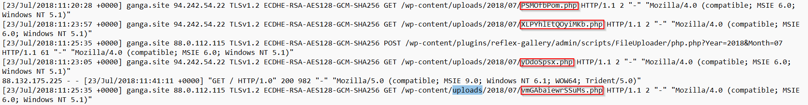
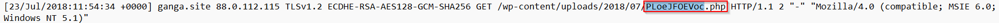
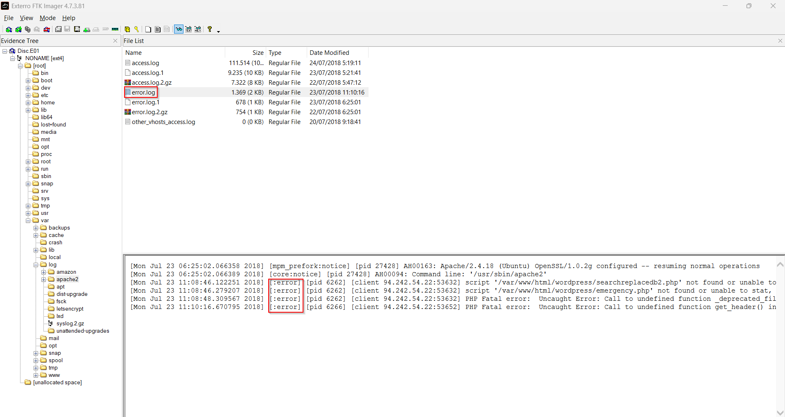
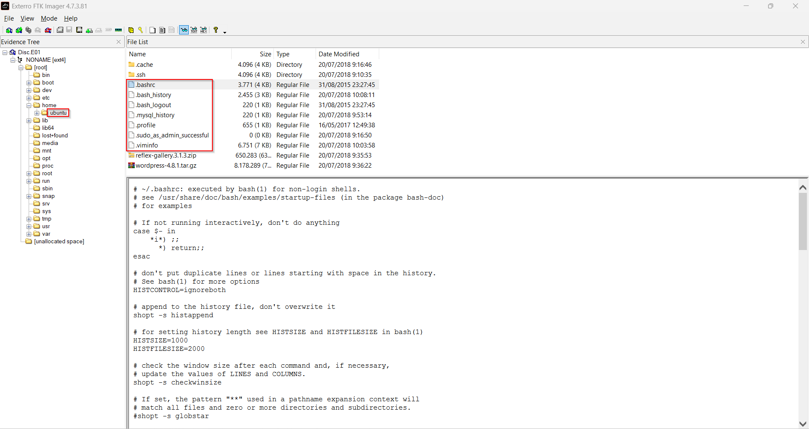
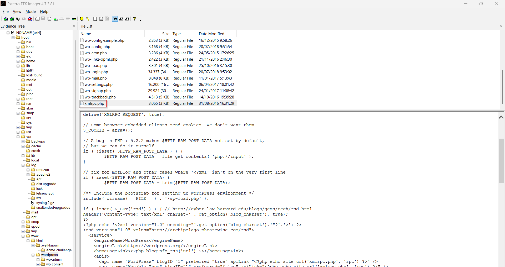

#### 7.2.2 Análisis de la imagen de disco

**Vector de entrada — CVE-2015-4133**

El examen de `/var/log/apache2/access.log` reveló el vector de ataque. A las 11:08 UTC del
23/07/2018, la IP `94.242.54.22` lanzó WPScan v2.9.5-dev contra el servidor. El scanner
descargó el archivo `readme.txt` del plugin Reflex Gallery con respuesta HTTP 200, exponiendo
la versión **3.1.3**, afectada por CVE-2015-4133 (*Unrestricted File Upload* — carga de
archivos arbitrarios sin autenticación). A las 11:20 UTC se inició la explotación mediante
POST al endpoint `wp-content/plugins/reflex-gallery/FileUploader/php.php`.

Figura: Endpoint 'wp/content/plugins/reflex-gallery/FileUploader/php.php'

| Atributo | Valor |
|---|---|
| Ruta | `/var/log/apache2/access.log` |
| Tamaño | 108 KB |
| MD5 | 325d4e7fad4213e46faf58dcf76af017 |
| SHA256 | 46BF61392DE369143890AE080E91502050F9478CD3D1DCB063C8223A6E58662E |
| Date Created | 23/07/2018 06:25:01 UTC |
| Date Modified | 24/07/2018 05:19:11 UTC |

**Webshells desplegadas**

Se identificaron cinco archivos PHP maliciosos subidos al directorio
`/wp-content/uploads/2018/07/`. Los nombres aleatorios de entre 8 y 16 caracteres son
consistentes con la función `rand_text_alpha` del módulo Metasploit
`exploit/unix/webapp/wp_reflexgallery_file_upload`. Todos devolvieron HTTP 200 al ser
ejecutados, confirmando su correcta ejecución por el servidor.

Figura: Cuatro archivos PHP maliciosos

Figura: Quinto archivo PHP malicioso

| Archivo | IP origen | Hora UTC |
|---|---|---|
| `PSMOfbPom.php` | `94.242.54.22` | 11:20:26 |
| `yDdoSpsx.php` | `94.242.54.22` | 11:20:28 |
| `XLPYhlEtQOyiMKb.php` | `94.242.54.22` | 11:23:57 |
| `vmGAbaiewrSSuMs.php` | `88.0.112.115` | 11:25:35 |
| `PLoeJFOEVoc.php` | `88.0.112.115` | 11:54:34 |

Los archivos PHP no fueron recuperados en el sistema de archivos, lo que indica que el
atacante los eliminó del disco tras su ejecución. Los timestamps del directorio de uploads
(`Date Modified 11:54:36`, `Date Accessed 11:54:56`) corroboran la escritura y ejecución
durante la segunda sesión de ataque.

**Error log de Apache**

`/var/log/apache2/error.log` aportó evidencia complementaria. La ausencia de `searchreplacedb2.php`
y `emergency.php` en el servidor a las 11:08:46 confirma que no existían compromisos previos
al ataque documentado. Los errores PHP fatales en `rss-functions.php` (11:08:48) y en
`index.php` del tema `twentyseventeen` (11:10:16) son consecuencia directa del fingerprinting
agresivo de WPScan y revelan la ruta absoluta del servidor:
`/var/www/html/wordpress/`.

Figura: Log del archivo error.log con los errores citados

| Atributo | Valor |
|---|---|
| Ruta | `/var/log/apache2/error.log` |
| Tamaño | 2 KB |
| MD5 | 496044572974077b25d87ecc950ec4bc |
| SHA256 | A8F34244C110114462935045C11C9208F846B54ABE47EA69909EBBD46518EAEC |
| Date Created | 23/07/2018 06:25:01 UTC |
| Date Modified | 23/07/2018 11:10:16 UTC |

**Artefactos del administrador — `/home/ubuntu/`**

Los artefactos presentes en el directorio home del usuario `ubuntu` (`.bash_history`,
`.mysql_history`, `.viminfo`, `authorized_keys`) tienen todos su última modificación el
**20/07/2018** y ninguno registra acceso el día del ataque. Esto confirma que el atacante no
obtuvo acceso interactivo al sistema ni modificó el entorno del usuario administrador. El
`.bash_history` documenta la instalación del stack y el despliegue de WordPress 4.8.1; el
`.mysql_history` confirma la creación de la base de datos `ganga` con conexión al endpoint
RDS de Amazon `ganga.ctmbcxcdb3us.eu-central-1.rds.amazonaws.com`.

Figura: Archivos del directorio home de 'ubuntu'

**`xmlrpc.php` activo**

El archivo `/var/www/html/wordpress/xmlrpc.php` estaba presente y activo, con `Date Accessed`
en `23/07/2018 11:08:46`, coincidiendo exactamente con las peticiones de WPScan. El archivo
corresponde al original de WordPress sin modificaciones, pero su exposición supone un vector
de ataque adicional para fuerza bruta amplificada mediante `system.multicall` y abuso de
pingbacks.

Figura: Archivo xmlrpc.php

---

## 8. Limitaciones

| Limitación | Descripción |
|---|---|
| IP del servidor de mando y control (LHOST) no recuperada | Los sockets TCP de Apache aparecen en estado `CLOSE` en el volcado. La dirección IP del C2 de Metasploit podría recuperarse mediante análisis binario de las regiones `rwx` volcadas por `malfind`, lo que queda fuera del alcance de este análisis |
| Archivos PHP maliciosos eliminados del disco | Los cinco archivos PHP no están presentes en el sistema de archivos de la imagen de disco. Su existencia queda acreditada por los logs y por los artefactos en RAM, pero no es posible realizar análisis estático de su código desde el disco |
| Relación entre `94.242.54.22` y `88.0.112.115` no determinada | No es posible confirmar con los datos disponibles si ambas IPs corresponden al mismo actor (uso de VPN o pivot) o a dos actores distintos coordinados |
| Ausencia de registros de red adicionales | No se dispone de capturas de tráfico (PCAP) ni registros de cortafuegos que permitan correlacionar las conexiones a nivel de paquete |

---

## 9. Conclusiones

El 23 de julio de 2018, un atacante identificó el plugin Reflex Gallery 3.1.3 instalado en el
WordPress de `ganga.site` mediante reconocimiento manual y automatizado con WPScan, y explotó
la vulnerabilidad CVE-2015-4133 para subir cinco archivos PHP sin necesidad de autenticación.
Una de las cargas maliciosas (`vmGAbaiewrSSuMs.php`) contenía un agente Meterpreter de
Metasploit que se ejecutó dentro del proceso Apache y quedó residente en memoria hasta el
momento del volcado, aunque su canal de comunicación con el servidor de mando y control ya
había cerrado. Los archivos PHP fueron eliminados del disco tras su ejecución, pero su
existencia y ejecución quedan acreditadas por los registros de Apache y por los artefactos
recuperados de la memoria RAM.

No se encontró evidencia de escalada de privilegios al usuario `ubuntu`, de modificación del
core de WordPress, de persistencia más allá del proceso Apache ni de actividad maliciosa
previa al 23 de julio de 2018.

---

## 10. Anexo 1. Sobre el Perito

| Campo | Valor |
|---|---|
| Grupo | Grupo 3 |
| Asignatura | Análisis Forense Informático |
| Fecha del informe | 20/04/2026 |

---

## 11. Anexo 2. Sumas de Verificación

| Evidencia | Algoritmo | Hash |
|---|---|---|
| `Disc.E01` | MD5 | bac5561328b477f0508fab7c5d9ee0a6 |
| `Disc.E01` | SHA1 | 5b0a9cc8ff4ebd5aa3e1e36d8713e3b24b072e79 |
| `RAM.bin` | MD5 | *(valor del hashrat)* |
| `RAM.bin` | SHA1 | *(valor del hashrat)* |
| `access.log` | MD5 | 325d4e7fad4213e46faf58dcf76af017 |
| `access.log` | SHA256 | 46BF61392DE369143890AE080E91502050F9478CD3D1DCB063C8223A6E58662E |
| `error.log` | MD5 | 496044572974077b25d87ecc950ec4bc |
| `error.log` | SHA256 | A8F34244C110114462935045C11C9208F846B54ABE47EA69909EBBD46518EAEC |
| `xmlrpc.php` | MD5 | 6c53e2ff076280c5cfc410a3c632c785 |
| `xmlrpc.php` | SHA256 | 639CD36E1C7262A5DF907DFBDFCC5F3BC64E152A9389AAF5DE606F17A1434314 |