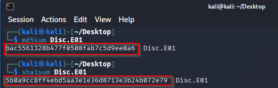
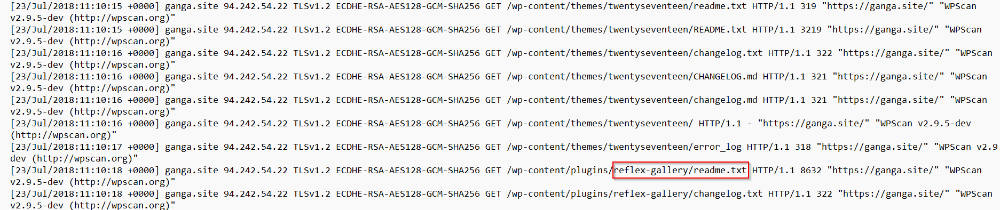
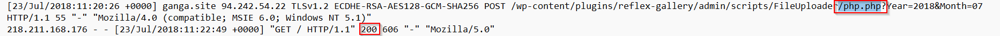
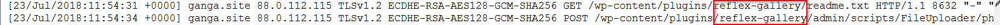

# Memoria de Trabajo — Análisis Forense de Imagen de Disco

## 1. Información del Caso

| Campo               | Valor                               |
|---------------------|-------------------------------------|
| Analistas            | Grupo 3              |
| Fecha de inicio     | 15/04/2026                          |
| Hora de inicio      | 12:10 CEST                          |
| Nombre del caso     | Análisis de Imagen de Disco         |
| Identificador       | Disc.E01                            |
| Herramientas usadas | Autopsy 4.22.1, FTK Imager 4.7.3.81 |

---

## 2. Adquisición y Verificación de la Evidencia

### 2.1 Descarga del archivo

- **Archivo recibido:** `Disc.E01.zip`
- **Fuente:** Moodle
- **Fecha y hora de descarga:** 15/04/2026 — 12:12 CEST

### 2.2 Descompresión

Descomprimimos el archivo `Disc.E01.zip`.

- **Archivo resultante:** `Disc.E01`
- **Tamaño de la imagen (Size):** 983.1 MiB (1,030,873,131 bytes)
- **Tamaño en disco (Size on Disk):** 983.1 MiB (1,030,881,280 bytes)

### 2.3 Verificación de integridad mediante hashes

Se procedió al cálculo de los valores hash de la imagen forense con el objetivo de verificar
su integridad respecto a los valores proporcionados por el docente/proveedor.

#### Hashes calculados

```bash
md5sum Disc.E01
sha1sum Disc.E01
```

| Algoritmo | Hash calculado                               | Hash proporcionado                           | ¿Coincide? |
|-----------|----------------------------------------------|----------------------------------------------|------------|
| MD5       | bac5561328b477f0508fab7c5d9ee0a6             | bac5561328b477f0508fab7c5d9ee0a6             | Sí      |
| SHA1      | 5b0a9cc8ff4ebd5aa3e1e36d8713e3b24b072e79     | 5b0a9cc8ff4ebd5aa3e1e36d8713e3b24b072e79     | Sí      |



> **Conclusión:** La integridad de la imagen ha sido verificada. La imagen no ha sido alterada desde su adquisición.

---

## 3. Herramientas Utilizadas

El análisis de la imagen forense `Disc.E01` se ha llevado a cabo utilizando **dos herramientas de forma paralela e independiente**, con el objetivo de maximizar la cobertura de artefactos y validar los hallazgos mediante contraste entre fuentes:

| Herramienta    | Versión    | Plataforma | Función principal                                                                                  |
|----------------|------------|------------|----------------------------------------------------------------------------------------------------|
| **Autopsy**    | 4.22.1     | Windows    | Análisis completo: módulos de ingest, timeline, artefactos del sistema, archivos eliminados        |
| **FTK Imager** | 4.7.3.81   | Windows    | Exploración directa del sistema de archivos, extracción de artefactos, verificación de hashes, extracción de MFT |

---

## 4. Análisis de Evidencias

### 4.1 Línea de Tiempo del Ataque

La siguiente tabla reconstruye cronológicamente los eventos identificados durante el análisis, relacionando las evidencias localizadas en los distintos artefactos del sistema:

| Hora (UTC)   | Origen             | Evento                                                                          | Artefacto fuente       |
|--------------|--------------------|---------------------------------------------------------------------------------|------------------------|
| `06:25:02`   | Sistema            | Arranque normal del servidor Apache 2.4.18                          | `error.log`            |
| `11:08:46`   | `94.242.54.22`     | WPScan inicia reconocimiento activo del servidor WordPress                      | `access.log`           |
| `11:08:46`   | `94.242.54.22`     | Peticiones a `xmlrpc.php` — endpoint activo y respondiendo                     | `access.log`           |
| `11:08:46`   | `94.242.54.22`     | Búsqueda de `searchreplacedb2.php` y `emergency.php` — no encontrados          | `error.log`            |
| `11:08:48`   | `94.242.54.22`     | PHP Fatal error en `rss-functions.php` por fingerprinting de versión           | `error.log`            |
| `11:08:xx`   | `94.242.54.22`     | Petición a `readme.txt` del plugin ReFlex Gallery — versión 3.1.3 expuesta     | `access.log`           |
| `11:10:16`   | `94.242.54.22`     | PHP Fatal error en `index.php` del tema `twentyseventeen` — prueba de RCE      | `error.log`            |
| `11:20:xx`   | `94.242.54.22`     | POST a `php.php` — explotación de CVE-2015-4133 y subida de webshells          | `access.log`           |
| `11:20:xx`   | `94.242.54.22`     | GET a `PSMOfbPom.php`, `XLPYhlEtQOyiMKb.php`, `yDdoSpsx.php` — ejecución confirmada | `access.log`      |
| `11:54:xx`   | `88.0.112.115`     | Segunda sesión de ataque — mismo vector CVE-2015-4133                           | `access.log`           |
| `11:54:xx`   | `88.0.112.115`     | GET a `VmGAbaiewrSSuMs.php`, `PLoeJFOEVoc.php` — ejecución confirmada          | `access.log`           |

---

### 4.2 Hallazgo 1: CVE-2015-4133 — Vector de entrada

**Artefacto fuente:** `/var/log/apache2/access.log`

| Atributo     | Valor                                         |
|--------------|-----------------------------------------------|
| Nombre       | `access.log`                                  |
| Ruta         | `/var/log/apache2/access.log`                 |
| Tamaño       | 108 KB    |
| Hash SHA256    | 46BF61392DE369143890AE080E91502050F9478CD3D1DCB063C8223A6E58662E|

Al examinar el archivo `/var/log/apache2/access.log` se detectaron peticiones al plugin
`reflex-gallery`. La respuesta `200 OK` al fichero `readme.txt` del plugin expuso la versión
instalada (**ReFlex Gallery 3.1.3**), que tras consultar NVD y Exploit-DB resultó estar
afectada por **CVE-2015-4133** (*Unrestricted File Upload*, sin autenticación requerida).



En el log se identificó un escaneo previo con **WPScan v2.9.5-dev** desde `94.242.54.22`
a las `11:08`, seguido de la explotación a las `11:20` mediante POST al endpoint vulnerable
`php.php`. Las peticiones GET inmediatas a los archivos subidos devolvieron `HTTP 200`,
confirmando la ejecución de las webshells. A las `11:54`, una segunda IP (`88.0.112.115`)
repitió el mismo ataque.





[Archivo del hallazgo](hallazgos/access.log)

---

### 4.3 Hallazgo 2: Webshells PHP desplegadas en el servidor

**Artefacto fuente:** `/var/log/apache2/access.log` + sistema de archivos `/wp-content/uploads/2018/07/`


Las peticiones registradas devolvieron código de respuesta **HTTP 200**, confirmando que los
archivos fueron ejecutados con éxito por el servidor web. Los nombres aleatorios de entre 8 y
16 caracteres alfanuméricos son consistentes con el patrón de nomenclatura generado
automáticamente por el módulo Metasploit `exploit/unix/webapp/wp_reflexgallery_file_upload`,
que utiliza la función `rand_text_alpha` para evadir detecciones basadas en firmas estáticas.

Ambas IPs atacantes (`94.242.54.22` y `88.0.112.115`) accedieron a webshells distintas, lo
que indica que **cada sesión de ataque generó y ejecutó su propia shell**. La presencia de
estas webshells operativas supone un punto de acceso persistente al sistema, desde el cual el
atacante podría ejecutar comandos arbitrarios, exfiltrar datos o escalar privilegios.

[Archivo del hallazgo](hallazgos/access.log)

---

### 4.4 Hallazgo 3: Evidencia forense en `error.log` de Apache

**Artefacto fuente:** `/var/log/apache2/error.log`

| Atributo | Valor                               |
|----------|-------------------------------------|
| Nombre   | `error.log`                         |
| Ruta     | `/var/log/apache2/error.log`        |
| Tamaño   | 2 KB      |
| Hash SHA256 |A8F34244C110114462935045C11C9208F846B54ABE47EA69909EBBD46518EAEC |

Al examinar el archivo `/var/log/apache2/error.log` se obtuvieron cuatro entradas relevantes
que corroboran y complementan los Hallazgos 1 y 2.


| Hora (UTC) | IP origen      | Descripción                                                |
|------------|----------------|------------------------------------------------------------|
| `06:25:02` | —              | Arranque normal de Apache 2.4.18                |
| `11:08:46` | `94.242.54.22` | `searchreplacedb2.php` y `emergency.php` no encontrados    |
| `11:08:48` | `94.242.54.22` | PHP Fatal en `rss-functions.php` (fingerprinting)          |
| `11:10:16` | `94.242.54.22` | PHP Fatal en `index.php` del tema (ejecución directa)      |

Los errores generados por WPScan a las `11:08:46` al buscar `searchreplacedb2.php` y
`emergency.php` devolvieron `not found or unable to stat`, lo que **prueba que el servidor no
estaba comprometido antes del ataque**, estableciendo CVE-2015-4133 como único vector de
entrada. Además, los errores exponen la ruta absoluta del servidor:
`/var/www/html/wordpress/`, dato relevante para la localización de artefactos en el disco.

A las `11:08:48` se registró un `PHP Fatal error` en `rss-functions.php` provocado por el
fingerprinting de versión de WPScan, y a las `11:10:16` un segundo `PHP Fatal error` en
`index.php` del tema `twentyseventeen`, indicativo de una **ejecución directa de ficheros PHP
fuera del contexto de WordPress**, consistente con pruebas de RCE post-explotación.

[Archivo del hallazgo](hallazgos/error.log)

---

### 4.5 Hallazgo 4: `xmlrpc.php` activo y expuesto

**Artefacto fuente:** `/var/www/html/wordpress/xmlrpc.php`

| Atributo | Valor                                          |
|----------|------------------------------------------------|
| Nombre   | `xmlrpc.php`                                   |
| Ruta     | `/var/www/html/wordpress/xmlrpc.php`           |
| Tamaño   |3 KB                  |
| Hash SHA256 | 639CD36E1C7262A5DF907DFBDFCC5F3BC64E152A9389AAF5DE606F17A1434314                 |

Durante el escaneo con WPScan a las `11:08:46`, se realizaron dos peticiones GET al endpoint
`/xmlrpc.php`, que respondió activamente confirmando que el protocolo XML-RPC estaba
habilitado en el servidor.


El archivo fue localizado en el disco y corresponde al fichero legítimo de WordPress, sin
modificaciones aparentes. Su presencia activa supone un vector de ataque adicional que permite
**ataques de fuerza bruta amplificados** mediante `system.multicall` —hasta cientos de
combinaciones de credenciales en una sola petición HTTP—, **ataques DDoS por abuso de
pingbacks** y **autenticación remota sin pasar por `/wp-admin`**, incrementando
significativamente la superficie de ataque del servidor comprometido.

[Archivo del hallazgo](hallazgos/xmlrpc.php)

---

### 4.6 Hallazgo 5: Artefactos en `/home/ubuntu` — Actividad del administrador

**Artefactos fuente:** `/home/ubuntu/`


En el directorio home del usuario `ubuntu` se localizaron múltiples artefactos del sistema que
en conjunto permiten reconstruir la historia de instalación y configuración del servidor,
corroborando la autenticidad del entorno y complementando los hallazgos anteriores. El
`.bash_history` registra la instalación manual del stack Apache+PHP, la configuración de HTTPS
mediante Let's Encrypt para `ganga.site`, el despliegue de **WordPress 4.8.1** desde
`wordpress-4.8.1.tar.gz` en `/var/www/html`, y conexiones al endpoint RDS de Amazon
`ganga.ctmbcxcdb3us.eu-central-1.rds.amazonaws.com`. El `.mysql_history` confirma la creación
manual de la base de datos `ganga` y la asignación de privilegios al usuario homónimo. El
`.viminfo` registra la edición directa de los archivos de configuración de Apache y contiene
el fragmento del formato de log SSL configurado, validando la autenticidad del formato de
entradas presente en el `access.log`. Los archivos `.profile` y `.bash_logout` corresponden a
plantillas estándar de Ubuntu sin modificaciones.

---

## 5. Pruebas con Resultado Negativo

Durante el análisis se realizaron las siguientes comprobaciones cuyo resultado fue negativo,
lo que igualmente aporta valor forense al delimitar el alcance del compromiso:

| Prueba realizada                                                              | Resultado    | Interpretación                                                                 |
|-------------------------------------------------------------------------------|--------------|--------------------------------------------------------------------------------|
| Búsqueda de `searchreplacedb2.php` en el servidor                            | No encontrado | El servidor no estaba comprometido antes del ataque con CVE-2015-4133         |
| Búsqueda de `emergency.php` en el servidor                                   | No encontrado | Confirma que no había webshells previas al ataque documentado                 |
| Análisis de `upload.php` (`/var/www/html/wordpress/wp-admin/`) en busca de código malicioso | Sin anomalías | Fichero legítimo de WordPress 4.8.1 sin modificaciones; el core no fue alterado |
| Búsqueda de `eval()`, `base64_decode()`, `system()` en `xmlrpc.php`         | Sin resultados | El fichero corresponde al original de WordPress, sin inyección de código      |
| Modificaciones en `.profile` y `.bash_logout`                               | Sin modificaciones | Ficheros de configuración estándar de Ubuntu; no hay backdoors en el entorno de login |

