# Análisis Forense Digital — Caso de Acoso Cibernético

## Índice

1. [Juramento y declaración de abstención y tacha](#1-juramento-y-declaración-de-abstención-y-tacha)
2. [Palabras clave](#2-palabras-clave)
3. [Índice de figuras](#3-índice-de-figuras)
4. [Resumen ejecutivo](#4-resumen-ejecutivo)
5. [Introducción](#5-introducción)
   - 5.1 [Antecedentes](#51-antecedentes)
   - 5.2 [Objetivos](#52-objetivos)
   - 5.3 [Alcance](#53-alcance)
6. [Fuentes de información](#6-fuentes-de-información)
   - 6.1 [Adquisición de evidencias](#61-adquisición-de-evidencias)
7. [Análisis](#7-análisis)
   - 7.1 [Herramientas utilizadas](#71-herramientas-utilizadas)
   - 7.2 [Procesos](#72-procesos)
     - 7.2.1 [Verificación de integridad](#721-verificación-de-integridad)
     - 7.2.2 [Análisis de conversaciones WhatsApp](#722-análisis-de-conversaciones-whatsapp)
     - 7.2.3 [Análisis de actividad en Telegram](#723-análisis-de-actividad-en-telegram)
     - 7.2.4 [Análisis del historial de búsquedas de Atalus](#724-análisis-del-historial-de-búsquedas-de-atalus)
     - 7.2.5 [Análisis de grabaciones cámara IP](#725-análisis-de-grabaciones-cámara-ip)
     - 7.2.6 [Análisis de accesos a Instagram de Lassandra](#726-análisis-de-accesos-a-instagram-de-lassandra)
     - 7.2.7 [Análisis del correo electrónico de la víctima](#727-análisis-del-correo-electrónico-de-la-víctima)
8. [Limitaciones](#8-limitaciones)
9. [Conclusiones](#9-conclusiones)
10. [Anexo 1. Sobre el perito](#10-anexo-1-sobre-el-perito)
11. [Anexo 2. Sumas de verificación](#11-anexo-2-sumas-de-verificación)

 

# 1. Juramento y Declaración de Abstención y Tacha

El/la abajo firmante, en calidad de perito/a informático/a, jura o promete solemnemente haber procedido y proceder con la mayor objetividad posible, tomando en consideración tanto lo que pueda favorecer como lo que sea susceptible de causar perjuicio a cualquiera de las partes, y que conoce las sanciones penales en las que podría incurrir si incumpliere su deber como perito/a.

Asimismo, declara no encontrarse incurso/a en ninguna de las causas de abstención o tacha previstas en la legislación vigente en relación con las partes implicadas en el presente procedimiento, y que no existe ningún vínculo personal, profesional ni económico que pueda comprometer su imparcialidad en la emisión del presente dictamen.

# 2. Palabras Clave

- **Rubber Ducky**: Dispositivo que se conecta por USB y simula ser un teclado para ejecutar comandos automáticos en el ordenador víctima.
- **Inyección de teclado**: suplantación de un teclado legítimo con el objetivo de ejecutar acciones en un equipo víctima. 

# 3. Índice de Figuras

**Figuras embebidas en el informe**

| Figura | Descripción | Sección |
|  --|    -|   -- |
| Figura 1 | Línea temporal del incidente | 4 |
| Figura 2 | Verificación hash — disco PC infectado (.img) | 7.2.1 |
| Figura 3 | Verificación hash — disco PC infectado (.zip) | 7.2.1 |
| Figura 4 | Verificación hash — copia ADB de Atalus Grasstem | 7.2.1 |
| Figura 5 | Verificación hash — copia ADB de Camillo Richbald | 7.2.1 |
| Figura 6 | Verificación hash — copia ADB de Lassandra Cordalis | 7.2.1 |
| Figura 7 | Verificación hash — imagen SD cámara IP Imou | 7.2.1 |
| Figura 8 | Verificación hash — datos Telegram de Lassandra | 7.2.1 |
| Figura 9 | Verificación hash — WhatsApp de Lassandra | 7.2.1 |
| Figura 10 | Verificación hash — WhatsApp de Atalus | 7.2.1 |
| Figura 11 | Verificación hash — WhatsApp de Camillo | 7.2.1 |
| Figura 12 | Verificación hash — Instagram de Lassandra | 7.2.1 |
| Figura 13 | Verificación hash — Google Data de Lassandra | 7.2.1 |
| Figura 14 | Verificación hash — Google Data de Atalus | 7.2.1 |
| Figura 15 | Verificación hash — Google Data de Camillo | 7.2.1 |

**Figuras en Anexos**

Las imágenes y vestigios referenciados a lo largo del análisis se encuentran documentados en el archivo [Anexos.md](anexos.md), numerados del 1 al 21 (imágenes) y del 1 al 10 (vestigios).

# 4. Resumen Ejecutivo

El análisis de los dispositivos y cuentas digitales de los implicados revela un caso
de acoso cibernético sostenido y acceso fraudulento a sistemas informáticos. Atalus
Grasstem acosó de forma reiterada a Lassandra Cordalis a través de WhatsApp y Telegram,
la vigiló físicamente y, tras ser bloqueado, ejecutó un ataque premeditado contra el
equipo informático de la víctima utilizando un dispositivo Rubber Ducky con el fin de
robarle las credenciales de acceso. Camillo Richbald participó activamente en la
planificación e instigación de dicho ataque. La culminación de la operación fue el
acceso no autorizado a la cuenta de Instagram de Lassandra y la manipulación de su
perfil público.

## Línea Temporal

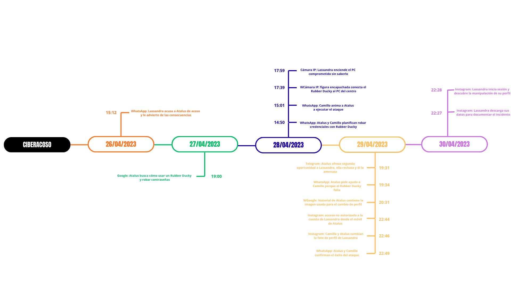

# 5. Introducción

## 5.1 Antecedentes

Lassandra Cordalis, estudiante del centro educativo, acudió a la dirección del mismo
para denunciar que venía siendo objeto de acoso por parte de un compañero, Atalus
Grasstem, y que su cuenta de Instagram había sido modificada sin su conocimiento ni
consentimiento. Ante estos hechos, se encargó un análisis forense digital para
esclarecer lo ocurrido y determinar las responsabilidades.

Se parte de la hipótesis de que Atalus Grasstem, con la colaboración de Camillo
Richbald, accedió de forma no autorizada al equipo informático de Lassandra mediante
un dispositivo de inyección de teclado tipo Rubber Ducky, robó sus credenciales y
utilizó estas para acceder y manipular su cuenta de Instagram.

## 5.2 Objetivos

- Documentar y reconstruir cronológicamente los hechos denunciados
- Acreditar el acoso digital ejercido por Atalus sobre Lassandra
- Determinar cómo se produjo el acceso no autorizado al equipo de la víctima
- Confirmar la implicación de Camillo Richbald como cómplice
- Establecer el vínculo entre las evidencias digitales y los hechos investigados

## 5.3 Alcance

El análisis abarca los dispositivos móviles de Atalus Grasstem, Camillo Richbald y
Lassandra Cordalis, sus bases de datos de WhatsApp, los datos exportados de sus
cuentas de Google, la base de datos de Telegram de la víctima, el export de su cuenta
de Instagram, la imagen forense del ordenador del aula y las grabaciones de la cámara
IP Imou del centro.

 

# 6. Fuentes de Información

## 6.1 Sumas de verificación

Antes de iniciar cualquier proceso de análisis, se procedió a calcular y comparar los
valores hash de cada evidencia con los de referencia proporcionados. La verificación
confirma que ninguna de las evidencias ha sido alterada desde su adquisición original.

Se muestran las sumas de verificación y los comandos utilizados en el [Anexo 2](#102-anexo-2-sumas-de-verificación)

## 6.1 Adquisición de Evidencias

A continuación se listan todas las evidencias sometidas a análisis.

| Evidencia | Tamaño (Bytes) |
|-----------|----------------|
| adb-backup-Atalus-Grasstem.ab | 29.013.457 |
| adb-backup-Camillo-Richbald.ab | 158.652 |
| adb-backup-Lassandra-Cordalis.ab | 523.014 |
| Disco-pc-infectado-ducky.img.zip | 5.773.164.742 |
| disco-pc-infectado-ducky.img | 53.687.091.200 |
| Google-Data-Atalus-Grasstem.zip | 561.760 |
| Google-Data-Camillo-Richbald.zip | 408.222 |
| Google-Data-Lassandra-Cordalis.zip | 588.782 |
| imagen-sd.ad1 | 6.847.296 |
| Instagram-lassandracordalis-20230504.zip | 735.897 |
| Telegram-Data-Lassandra-Cordalis.zip | 30.820.559 |
| WhatsApp-Database-Atalus-Grasstem.zip | 131.501 |
| WhatsApp-Database-Camillo-Richbald.zip | 185.621 |
| WhatsApp-Database-Lassandra-Cordalis.zip | 167.088 |

# 7. Análisis

## 7.1 Herramientas Utilizadas

| Herramienta | Version | Uso |
| --- | --- | --- |
| WhatsApp Msgstore Viewer | Ultima disponible | Lectura y visualizacion de mensajes desde msgstore.db |
| DB Browser for SQLite | 3.12.2.0 | Inspeccion manual de bases de datos SQLite |
| FTK Imager | 3.1.2 | Adquisicion y verificacion de imagenes forenses |
| Android Backup Extractor | master-20221109063121 | Extraccion de copias de seguridad ADB |
| telegram_extractor.py | 1.0 (script propio) | Extraccion de mensajes desde cache4.db de Telegram |
| USB Detective | 1.2 | Analisis de artefactos de conexion de dispositivos USB |

## 7.2 Procesos

### 7.2.1 Análisis de Conversaciones WhatsApp

El análisis de la base de datos de WhatsApp de Lassandra muestra cómo Atalus estableció contacto con ella el 26 de abril de 2023, presentándose como compañero de clase e insistiendo en quedar. La víctima rechazó sus propuestas en varias ocasiones. Al día siguiente, Atalus reveló haber estado vigilándola físicamente
al mencionar haberla visto salir del cine, a lo que Lassandra respondió acusándole directamente de acoso.

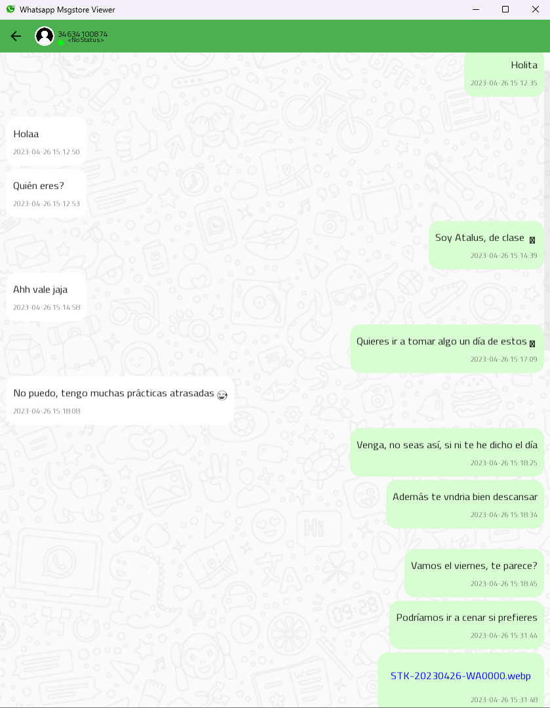

[Véase Anexo de Imágenes. Imagen 1.](anexos.md)

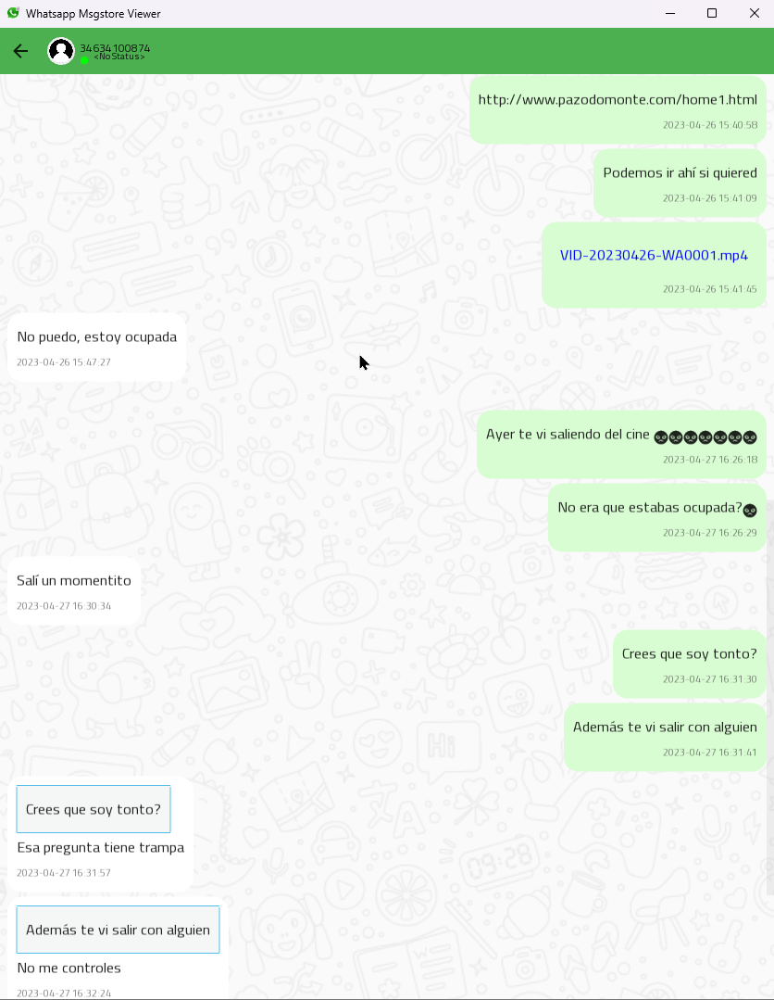

[Véase Anexo de Imágenes. Imagen 2.](anexos.md)

[Véase Anexo de Imágenes. Imagen 3.](anexos.md)

| Campo | Valor |
| --- | --- |
| Ruta | WhatsApp-Database-Lassandra-Cordalis/msgstore.db |
| Tamano | 1.228.800 bytes |
| HASH MD5 | 4f7e0758d093ce4cf33e1c851dc62c9f |
| HASH SHA256 | dcc837420c7d72b7b3ea09483ff0586daa7a50ca9c8c78b790db95866dcae0f5 |
| Contenido |  |

[Véase Anexo de Vestigios. Vestigio 1.](anexos.md)

En el WhatsApp de Atalus se encontró además una conversación con Camillo Richbald
fechada el 28 de abril, en la que Atalus comunica haber sido bloqueado por Lassandra
y ambos planifican una represalia. En este intercambio Atalus describe abiertamente
su plan de usar un Rubber Ducky para robar las credenciales de la víctima, y Camillo
responde animándole a ejecutarlo.

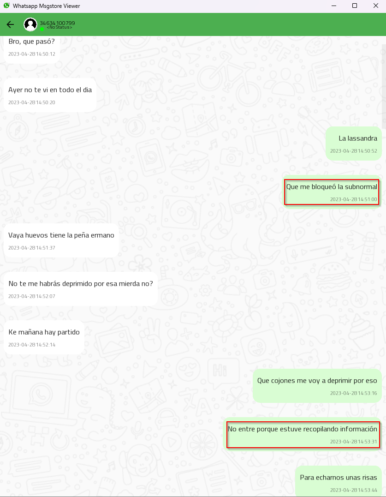

[Véase Anexo de Imágenes. Imagen 4.](anexos.md)

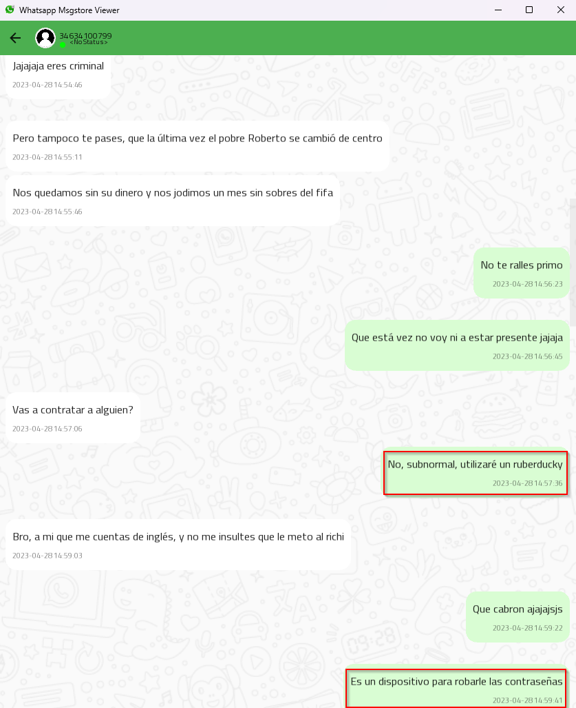

[Véase Anexo de Imágenes. Imagen 5.](anexos.md)

[Véase Anexo de Imágenes. Imagen 6.](anexos.md)

La conversación entre Atalus y Camillo continuó el 29 de abril de 2023. En este punto
el Rubber Ducky ya había sido conectado en el ordenador del centro el día anterior,
pero Atalus encontró dificultades técnicas.
Tras desplazarse al domicilio de Camillo para solventar el problema,
Atalus confirmó a las 20:25 que ya podía operar con normalidad.
A partir de ese momento, y siguiendo la sugerencia de Camillo,
quien le envió la imagen que quería usar como foto de perfil de la víctima, Atalus
procedió a acceder de forma no autorizada a la cuenta de Instagram de Lassandra.

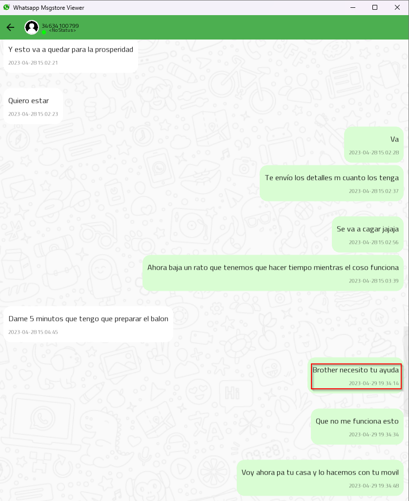

[Véase Anexo de Imágenes. Imagen 7.](anexos.md)

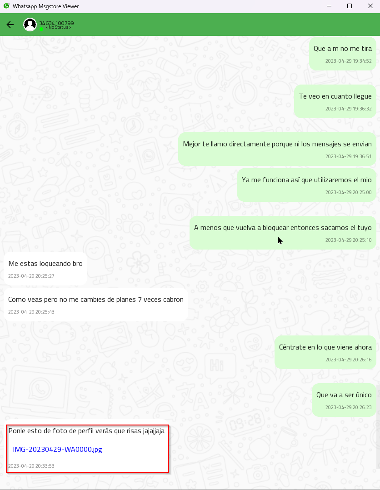

[Véase Anexo de Imágenes. Imagen 8.](anexos.md)

[Véase Anexo de Imágenes. Imagen 9.](anexos.md)

[Véase Anexo de Vestigios. Vestigio 2.](anexos.md)

### 7.2.2 Análisis de Actividad en Telegram

Tras el bloqueo en WhatsApp, Atalus continuó el hostigamiento a través de Telegram el 28 de abril a las 19:31.
Los mensajes extraídos de la base de datos de Lassandra muestran un tono amenazante
y recriminatorio, con referencias directas al rechazo recibido.

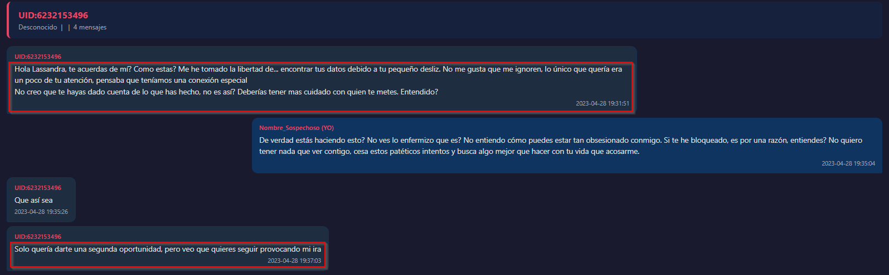

[Véase Anexo de Imágenes. Imagen 10.](anexos.md)

[Véase Anexo de Vestigios. Vestigio 4.](anexos.md)

### 7.2.3 Análisis del Historial de Búsquedas de Atalus

El examen de los datos de Google de Atalus revela búsquedas específicas el 27 de abril a partir de las 19:00, sobre el funcionamiento de dispositivos Rubber Ducky, métodos de robo de credenciales y
formas de obtener imágenes de perfil de cuentas de Instagram ajenas. Estas consultas
son anteriores a la ejecución del ataque, lo que evidencia una premeditación clara
y un proceso de preparación técnica previo.

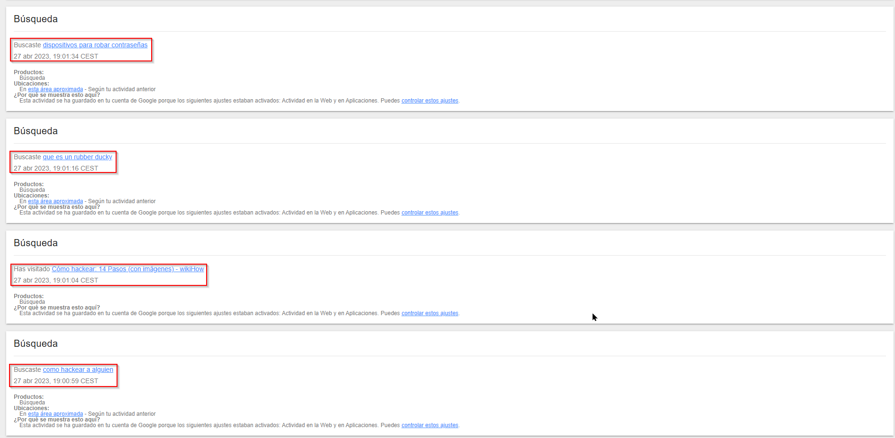

[Véase Anexo de Imágenes. Imagen 11.](anexos.md)

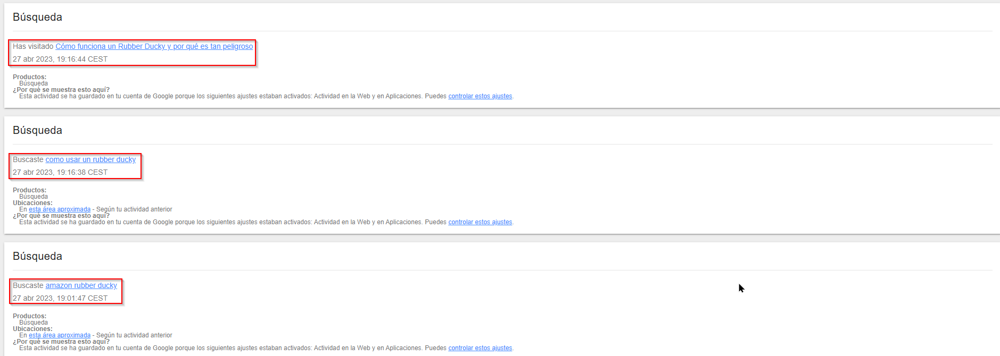

[Véase Anexo de Imágenes. Imagen 12.](anexos.md)

[Véase Anexo de Vestigios. Vestigio 3.](anexos.md)

### 7.2.4 Análisis de Grabaciones Cámara IP

Las grabaciones de la cámara IP Imou del centro muestran a una persona con capucha
el 28 de abril de 2023 que se acerca a uno de los equipos del aula, conecta un
dispositivo USB y abandona rápidamente el lugar. Posteriormente, Lassandra se sienta
en ese mismo ordenador y trabaja con él, momento en el que el payload del Rubber
Ducky ya habría ejecutado la extracción de sus credenciales de forma silenciosa.

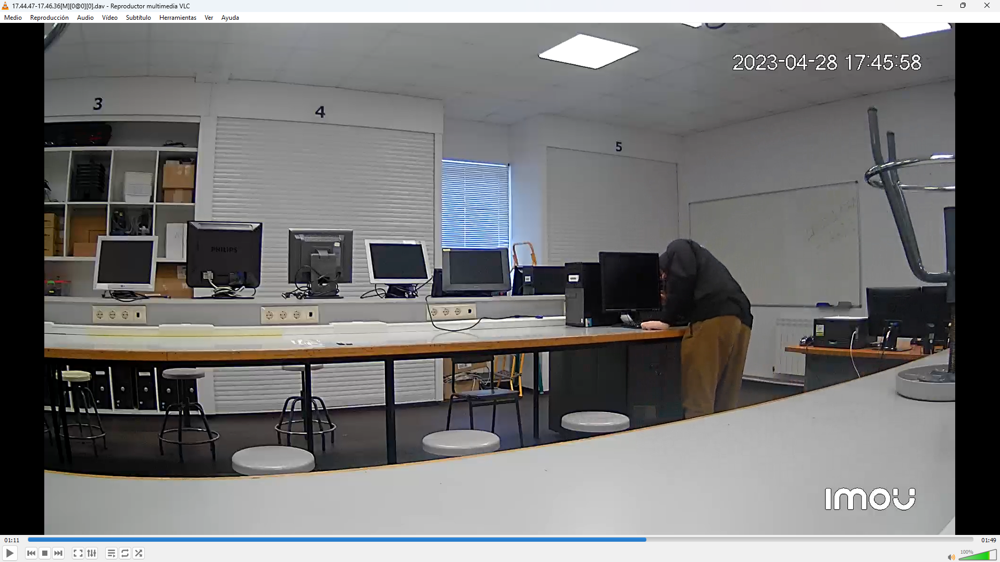

[Véase Anexo de Imágenes. Imagen 13.](anexos.md)

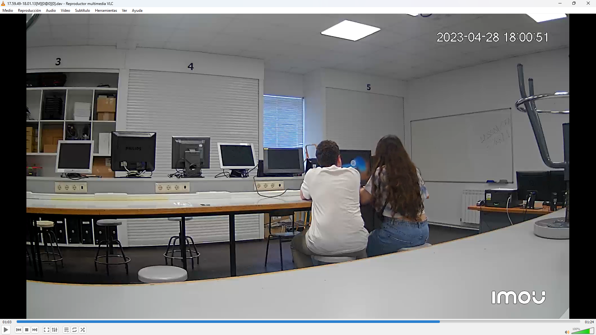

[Véase Anexo de Imágenes. Imagen 14.](anexos.md)

[Véase Anexo de Vestigios. Vestigio 5.](anexos.md)

[Véase Anexo de Vestigios. Vestigio 6.](anexos.md)

### 7.2.5 Análisis de Accesos a Instagram de Lassandra

El registro de actividad de la cuenta de Instagram de Lassandra muestra tres inicios
de sesión desde dispositivos diferentes. El primero procede de un navegador de
escritorio cuya marca temporal coincide con la segunda grabación de la cámara IP.
El segundo se origina desde un agente de usuario que corresponde exactamente al
terminal móvil de Atalus, identificado cruzando los datos de su cuenta de Google.

> **Nota:** todas las marcas horarias de Instagram deben ajustarse sumando dos
> horas para obtener la hora local CEST (UTC+2), y diez horas adicionales en el caso
> de los registros internos de la plataforma.

[Véase Anexo de Imágenes. Imagen 15.](anexos.md)

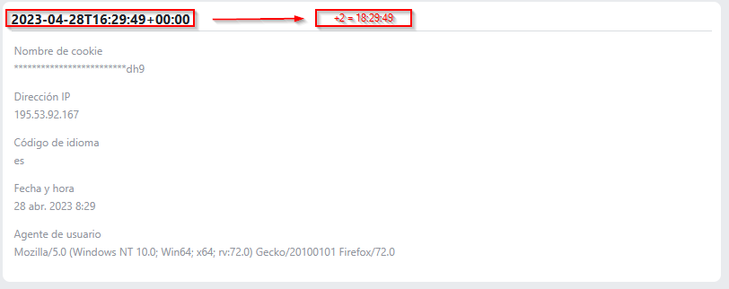

[Véase Anexo de Imágenes. Imagen 16.](anexos.md)

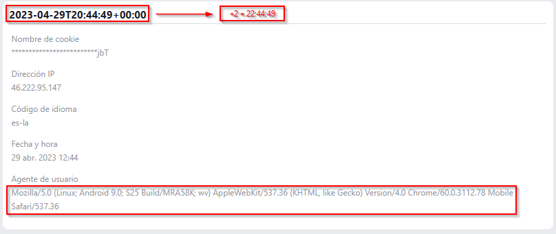

[Véase Anexo de Imágenes. Imagen 17.](anexos.md)

[Véase Anexo de Vestigios. Vestigio 7.](anexos.md)

[Véase Anexo de Vestigios. Vestigio 8.](anexos.md)

El historial del navegador del móvil de Atalus registra además la búsqueda y
selección de la imagen utilizada como nueva foto de perfil de Lassandra, imagen
que Camillo le había sugerido expresamente en la conversación de WhatsApp.

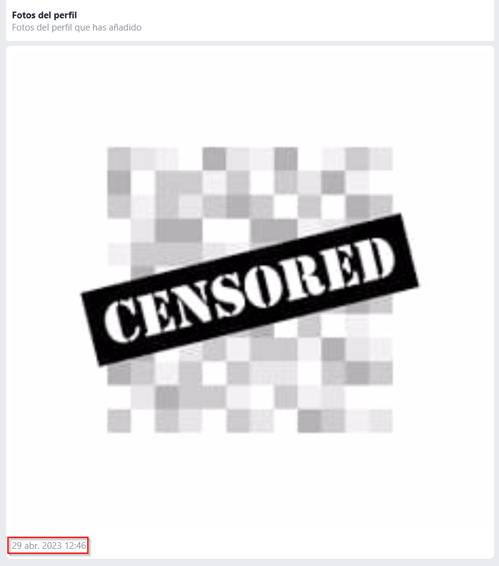

[Véase Anexo de Imágenes. Imagen 18.](anexos.md)

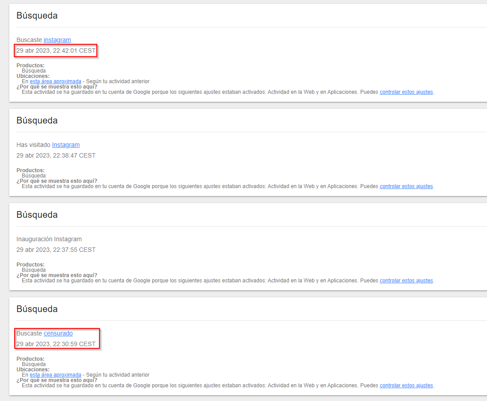

[Véase Anexo de Imágenes. Imagen 19.](anexos.md)

[Véase Anexo de Imágenes. Imagen 20.](anexos.md)

[Véase Anexo de Vestigios. Vestigio 9.](anexos.md)

### 7.2.6 Análisis del Correo Electrónico de la Víctima

El archivo de correo de Lassandra, obtenido del export de Google, contiene tres
notificaciones de acceso a su cuenta de Instagram que se corresponden con los eventos
identificados en el análisis: el acceso desde el ordenador del centro, el acceso desde
el móvil de Atalus y el acceso de la propia víctima al descubrir la manipulación.

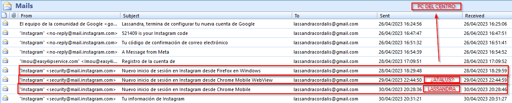

[Véase Anexo de Imágenes. Imagen 21.](anexos.md)

[Véase Anexo de Vestigios. Vestigio 10.](anexos.md)

 

# 8. Limitaciones

El presente análisis se ha llevado a cabo sobre las evidencias digitales proporcionadas, sin posibilidad de acceder físicamente a los dispositivos originales una vez realizadas las extracciones. Esto ha resultado en no poder verificar completamente que el usb "Rubber Ducky" contenía código malicioso.

 

# 9. Conclusiones

El origen del incidente es el rechazo de Lassandra hacia Atalus, que
escaló desde el acoso por mensajería hasta un ataque informático premeditado. Atalus
se documentó sobre el uso de dispositivos Rubber Ducky, conectó uno de ellos en el
ordenador que usaba la víctima en el centro educativo y obtuvo sus credenciales,
con las que accedió posteriormente a su Instagram desde su propio móvil para
alterar su perfil. En todo momento contó con el respaldo y la instigación de
Camillo Richbald.

**Recomendaciones**

- Bloqueo de puertos USB en los equipos del centro educativo para impedir la
  conexión de dispositivos no autorizados, eliminando el vector de ataque empleado.
- Activación de autenticación en dos factores en todas las cuentas digitales del
  alumnado, lo que habría impedido el acceso a Instagram incluso con las credenciales
  comprometidas.
- Formación en ciberseguridad dirigida tanto al alumnado como al personal docente,
  con especial atención al reconocimiento de situaciones de acoso digital y a la
  protección de credenciales personales.
- Implantación de un protocolo de denuncia confidencial dentro del centro para que
  el alumnado pueda reportar situaciones de ciberacoso de forma segura y sin temor
  a represalias.

 

# 10. Anexos.

## 10.1 Sobre el Perito

| Campo | Datos |
|  -|  -|
| Nombre y apellidos | Grupo3 Forensics |
| Titulación | Perritos forenses |
| Número de colegiado / acreditación | 4901948498 |
| Contacto | jimenezruizdavid2@gmail.com |

El perito declara haber actuado con plena independencia técnica y que las conclusiones
recogidas en este informe reflejan su opinión profesional fundamentada exclusivamente
en el análisis de las evidencias digitales disponibles.

 

## 10.2 Anexo 2. Sumas de Verificación

**Imagen del disco del PC de Lassandra**

**Extracción copia de seguridad ADB — Teléfono X25 de Atalus**

**Extracción copia de seguridad ADB — Teléfono Xiaomi Redmi Note 11 de Camillo**

**Extracción copia de seguridad ADB — Teléfono Xiaomi Redmi Note 11 de Lassandra**

**Imagen de la tarjeta SD de la Cámara IP Imou**

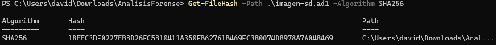

**Extracción conversaciones Telegram — Teléfono Xiaomi Redmi Note 11 de Lassandra (víctima)**

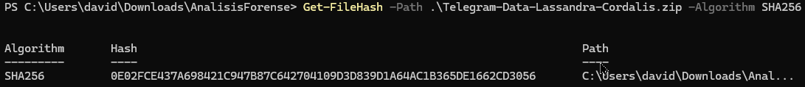

**Extracción conversaciones WhatsApp — Teléfono Xiaomi Redmi Note 11 de Lassandra (víctima)**

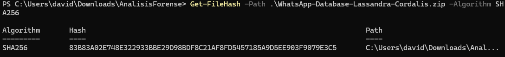

**Extracción conversaciones WhatsApp — Teléfono X25 de Atalus (principal sospechoso)**

**Extracción conversaciones WhatsApp — Teléfono Xiaomi Redmi Note 11 de Camillo (cómplice)**

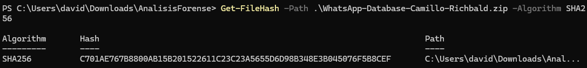

**Extracción copia de seguridad del servidor Instagram de Lassandra (víctima)**

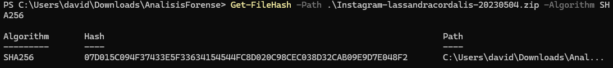

**Extracción copia de seguridad del servidor Google de Lassandra (víctima)**

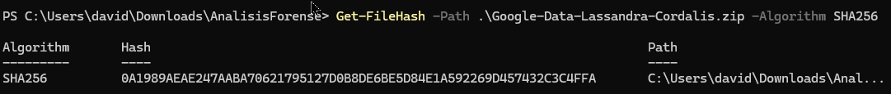

**Extracción copia de seguridad del servidor Google de Atalus (principal sospechoso)**

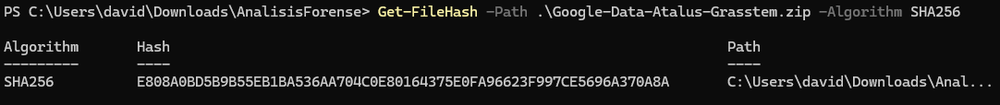

**Extracción copia de seguridad del servidor Google de Camillo (cómplice)**

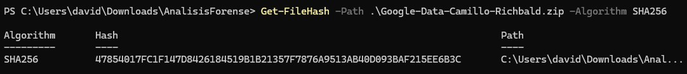

| Evidencia | Tamaño (Bytes) | SHA-256 | MD5 | SHA1 |
| -- | -- | -- | -- | -- |
| adb-backup-Atalus-Grasstem.ab | 29.013.457 | e64e952c3f43c235baf5d83f8cea1a86d7640821baefcbe89c480b0fff7688cf | 69E1E89FD971E5817A2C8C6279A80601 | 7EA6F0F6CADE8F6FA55C01C51C683216CD53D463 |
| adb-backup-Camillo-Richbald.ab | 158.652 | 9c9c983de848c7b600a8f97a191b2fc7f9c77f5826de42fef93b410094bfac43 | 927713F263F80B4B747F65E58A1BDD53 | 985B4C25B4B72201A7ED591338FBDA9629E12154 |
| adb-backup-Lassandra-Cordalis.ab | 523.014 | 40e6f12cf248468c2849aa2c8094d186b0264bb758d4839ee190486721da013a | DDFF7DFE751359D2C7ED4E743B91A774 | FC560A40196DC92D463C172481FBAF166D223C76 |
| Disco-pc-infectado-ducky.img.zip | 5.773.164.742 | a61abd7be758d6f494e84fcb743e78e65d3b30f95ffab7e65839fceaf3f7b21d | F5C17537B21F0E048237B9B6B1865548 | 3A7847F7BF9FE91D2794ED3B12CAC9953FADD63C |
| disco-pc-infectado-ducky.img | 53.687.091.200 | 33a147e409a2400a762845932c9cde7ce280fc944f4a6e6e50d8e0aece2f2ef0 | 39A7E7302BEB29233E579B5AC5DC8D4E | 1BFB7525B55F84CF9ABF776DE273533DF84D2204 |
| Google-Data-Atalus-Grasstem.zip | 561.760 | e808a0bd5b9b55eb1ba536aa704c0e80164375e0fa96623f997ce5696a370a8a | 0013A261768BB2E03410A4EE6AFCDF1D | B5842A7BA3C0C5FE58CDE803987C22AF17E49C65 |
| Google-Data-Camillo-Richbald.zip | 408.222 | 47854017fc1f147d8426184519b1b21357f7876a9513ab40d093baf215ee6b3c | 7B06EAE50B2601998BDB3EFB0969854A | B0BD8808EB5A00DFD77F98E8E4EC259719A02B45 |
| Google-Data-Lassandra-Cordalis.zip | 588.782 | 0a1989aeae247aaba70621795127d0b8de6be5d84e1a592269d457432c3c4ffa | 97AC95C08C9A2D5F3CD6780DEA9D27DC | ED5F5E2B68BC3021047AC7B6A1FD4B92B23F81D4 |
| imagen-sd.ad1 | 6.847.296 | 1beec3df0227eb8d26fc5810411a350fb62761b469fc380074d8978a7a048469 | 6DD44CD661AFED3D93EB96BDE12211BD | 22343FCE02A07CFE840104DA093715259F6738D1 |
| Instagram-lassandracordalis-20230504.zip | 735.897 | 07d015c094f37433e5f33634154544fc8d020c98cec038d32cab09e9d7e048f2 | 79B280F3FDA049A6B01DAF29BE56CDD4 | 515A23EB81ECC3E176DC2FEEB2DB5A0265ABFC2C |
| Telegram-Data-Lassandra-Cordalis.zip | 30.820.559 | 0e02fce437a698421c947b87c642704109d3d839d1a64ac1b365de1662cd3056 | 3ADBD1827E451EFA13F0DBB2227E7BC2 | 19B07D30A39565EE6AF03A90AA5FF5B64239797D |
| WhatsApp-Database-Atalus-Grasstem.zip | 131.501 | a50e56d3e6789b346cce39a90f392b88327000b3524c9cde231c7819a9c8da1f | 4591F56EE8ECCD774F896D43474104CD | D2A083436193A161E53F1D1E031CE0500ACBC69F |
| WhatsApp-Database-Camillo-Richbald.zip | 185.621 | c701ae767b8800ab15b201522611c23c23a5655d6d98b348e3b045076f5b8cef | 3478B015C867DFBCEECFCC49BC09C76E | B9BABDD79B25642826ECF3854842EBCDF915F222 |
| WhatsApp-Database-Lassandra-Cordalis.zip | 167.088 | 83b83a02e748e322933bbe29d98bdf8c21af8fd5457185a9d5ee903f9079e3c5 | 1477180EFC30A310B09166274D509C77 | 934014579462B514AA5D4A897558B17A6E63DFD0 |

