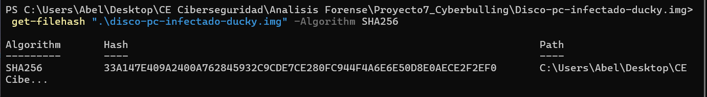
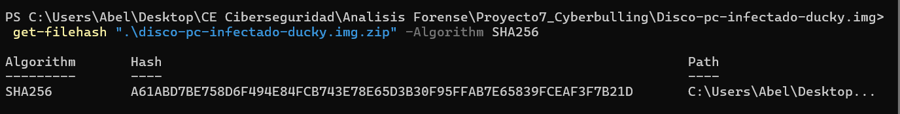
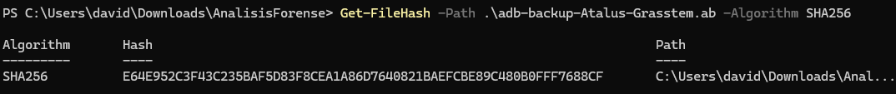
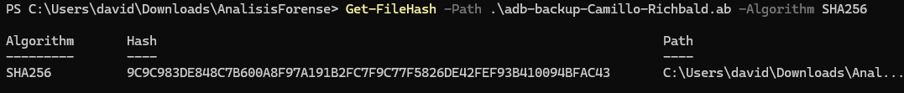
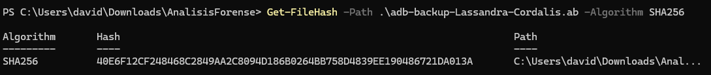

# Informe técnico

# 1. Resumen Ejecutivo

## 1.1 Línea Temporal

# 2. Introducción

## Verificación de integridad

- Imagen del disco del PC de Lassandra

- Extracción copia de seguridad ADB - Teléfono X25 de Atalus

- Extracción copia de seguridad ADB - Teléfono Xiaomi Redmi Note 11 de Camillo

- Extracción copia de seguridad ADB - Teléfono Xiaomi Redmi Note 11 de Lassandra

