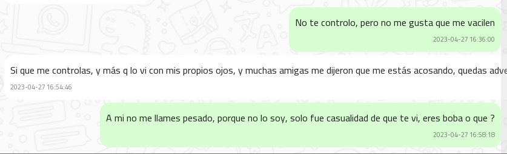
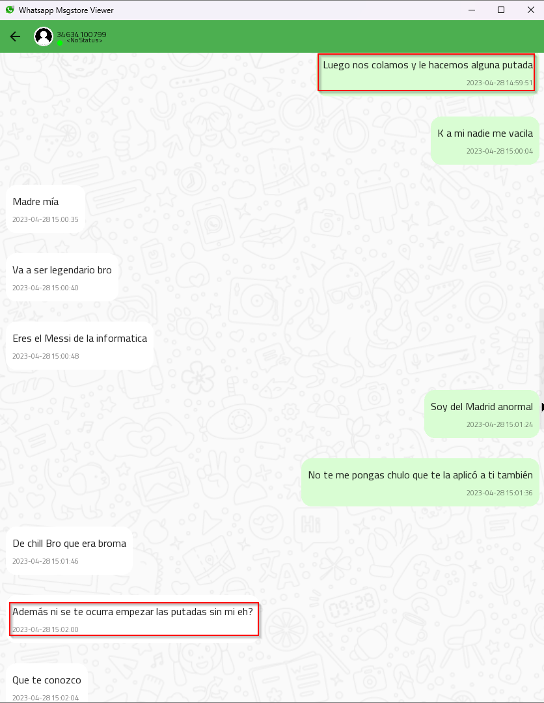
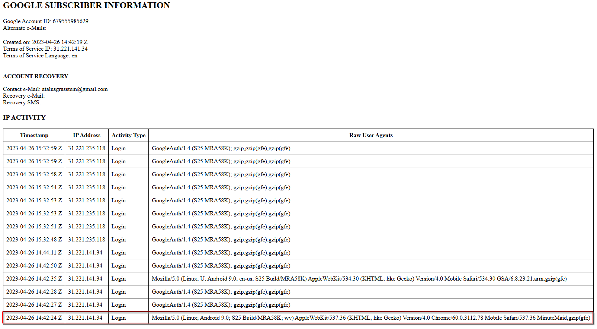
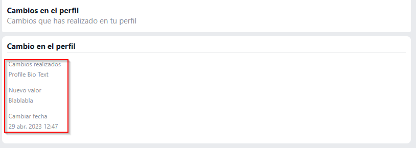

# Anexos — Caso Forense Digital

## Indice

1. [Metodologia](#metodologia)
2. [Herramientas Empleadas](#herramientas)
3. [Imagenes](#imagenes)
4. [Vestigios](#vestigios)

---

## 1. Metodologia

El proceso de investigacion se estructuro en tres fases diferenciadas:

**Adquisicion de evidencias**

Se siguieron los criterios estandar de la forensia digital para garantizar la
integridad de cada artefacto:

1. Registro exacto de la fecha y hora de cada extraccion.
2. Minimizacion de la interaccion con los dispositivos analizados para evitar
   cualquier modificacion del estado original.
3. Recogida de evidencias respetando el orden de volatilidad.
4. Documentacion exhaustiva del proceso para asegurar su reproducibilidad por
   parte de cualquier otro perito.

**Preservacion y cadena de custodia**

Para cada evidencia se registro la siguiente informacion:

- Lugar, fecha y hora de descubrimiento y recogida.
- Identidad del responsable de la recogida y de cada acceso posterior.
- Condiciones y metodo de almacenamiento. Los dispositivos moviles se conservaron
  en bolsas de Faraday para impedir cualquier comunicacion inalambrica que pudiera
  comprometer su contenido.
- En caso de traspaso de custodia: nombre del nuevo responsable, fecha y hora,
  y verificacion de hashes para confirmar que no se ha producido alteracion alguna.

**Analisis**

Todas las actuaciones analiticas se llevaron a cabo respetando los principios de
metodicidad, auditabilidad, repetibilidad y defensa en juicio de cada conclusion.

---

## 2. Herramientas Empleadas

| Herramienta | Version | Uso |
| --- | --- | --- |
| WhatsApp Msgstore Viewer | Ultima disponible | Lectura y visualizacion de mensajes desde msgstore.db |
| DB Browser for SQLite | 3.12.2.0 | Inspeccion manual de bases de datos SQLite |
| FTK Imager | 3.1.2 | Adquisicion y verificacion de imagenes forenses |
| Android Backup Extractor | master-20221109063121 | Extraccion de copias de seguridad ADB |
| telegram_extractor.py | 1.0 (script propio) | Extraccion de mensajes desde cache4.db de Telegram |
| USB Detective | 1.2 | Analisis de artefactos de conexion de dispositivos USB |

---

## 3. Imagenes

[Imagen 1](#1) | [Imagen 2](#2) | [Imagen 3](#3) | [Imagen 4](#4) | [Imagen 5](#5) |
[Imagen 6](#6) | [Imagen 7](#7) | [Imagen 8](#8) | [Imagen 9](#9) | [Imagen 10](#10) |
[Imagen 11](#11) | [Imagen 12](#12) | [Imagen 13](#13) | [Imagen 14](#14) |
[Imagen 15](#15) | [Imagen 16](#16) | [Imagen 17](#17) | [Imagen 18](#18) |
[Imagen 19](#19) | [Imagen 20](#20) | [Imagen 21](#21) | [Imagen 22](#22) |
[Imagen 23](#23)

Imagen 1

Imagen 2

Imagen 3

Imagen 4

Imagen 5

Imagen 6

Imagen 7

Imagen 8

Imagen 9

Imagen 10

Imagen 11

Imagen 12

Imagen 13

Imagen 14

Imagen 15

Imagen 16

Imagen 17

Imagen 18

Imagen 19

Imagen 20

Imagen 21

## 4. Vestigios

[Vestigio 1](#v1) | [Vestigio 2](#v2) | [Vestigio 3](#v3) | [Vestigio 4](#v4) |
[Vestigio 5](#v5) | [Vestigio 6](#v6) | [Vestigio 7](#v7) | [Vestigio 8](#v8) |
[Vestigio 9](#v9) | [Vestigio 10](#v10)

Vestigio 1

| Campo | Valor |
| --- | --- |
| Ruta | WhatsApp-Database-Lassandra-Cordalis/msgstore.db |
| Tamano | 1.228.800 bytes |
| HASH MD5 | 4f7e0758d093ce4cf33e1c851dc62c9f |
| HASH SHA256 | dcc837420c7d72b7b3ea09483ff0586daa7a50ca9c8c78b790db95866dcae0f5 |
| Contenido |  |

Vestigio 2

| Campo | Valor |
| --- | --- |
| Ruta | WhatsApp-Database-Atalus-Grasstem/msgstore.db |
| Tamano | 1.273.856 bytes |
| HASH MD5 | abfacf6b7a029fe358d0a13c3ce7e2a8 |
| HASH SHA256 | 4a053239cfacab3f674a875c84cc0d80d873a418e608e1be249a26f93870f3cc |
| Contenido |  |

Vestigio 3

| Campo | Valor |
| --- | --- |
| Ruta | Google-Data-Atalus-Grasstem/takeout-20230505T011442Z-001/Takeout/Mi actividad/Busqueda/MiActividad.html |
| Tamano | 168.832 bytes |
| HASH MD5 | 107aa75dd60145151336cccaab37f21e |
| HASH SHA256 | dcbd51ba2f77917998623ae88b82ff10697bd8b53c78a46bbc9d6a8e28bcf1fe |
| Contenido |  |

Vestigio 4

| Campo | Valor |
| --- | --- |
| Ruta | telegram/apps/org.telegram.messenger/f/cache4.db |
| Tamano | 4.096 bytes |
| HASH MD5 | 48fd1091cab6792ec9f4f79184fc4a8e |
| HASH SHA256 | 7c0cbac0764d013f7a25b5fddabdc2e74706cd17c04d7c30c4d51c58b254b5eb |
| Contenido |  |