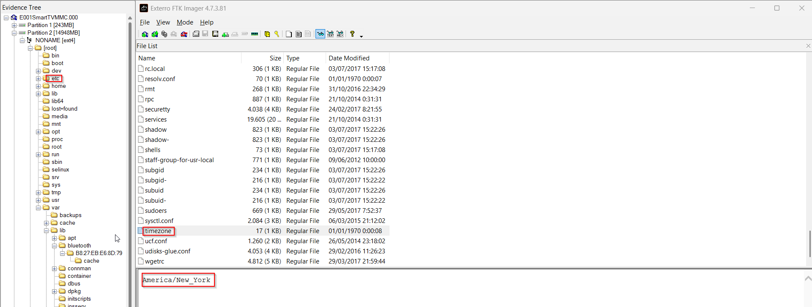
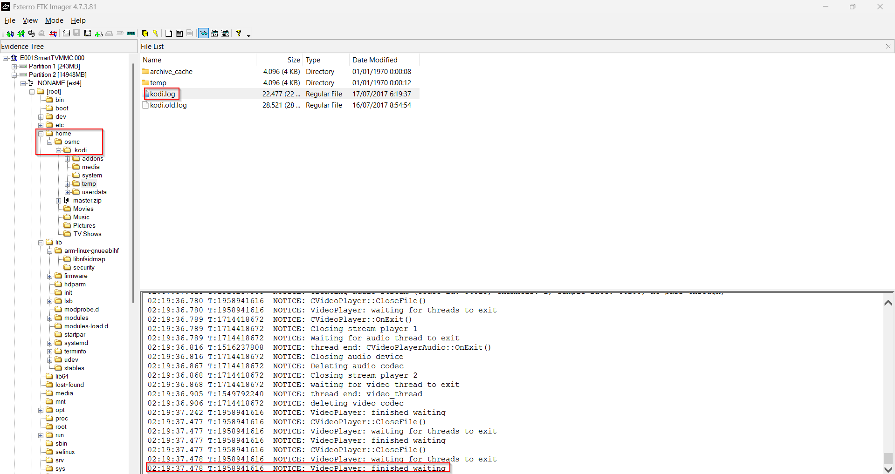

# Informe técnico: Proyecto 9. Caso de homicidio.

## Índice

- [Informe técnico: Proyecto 9. Caso de homicidio.](#informe-técnico-proyecto-9-caso-de-homicidio)
  - [Índice](#índice)
- [1. Juramento y Declaración de Abstención y Tacha](#1-juramento-y-declaración-de-abstención-y-tacha)
  - [2. Palabras clave](#2-palabras-clave)
  - [3. Índice de figuras](#3-índice-de-figuras)
  - [4. Resumen ejecutivo](#4-resumen-ejecutivo)
  - [5. Introducción](#5-introducción)
    - [5.1 Antecedentes](#51-antecedentes)
    - [5.2 Objetivos](#52-objetivos)
    - [5.3 Alcance](#53-alcance)
  - [6. Fuentes de información.](#6-fuentes-de-información)
  - [7. Análisis](#7-análisis)
    - [7.1 Herramientas utilizadas](#71-herramientas-utilizadas)
    - [7.2 Procesos](#72-procesos)
      - [7.2.1 Análisis del teléfono de la víctima.](#721-análisis-del-teléfono-de-la-víctima)
      - [7.2.2 Análisis del teléfono del marido de la víctima](#722-análisis-del-teléfono-del-marido-de-la-víctima)
      - [7.2.3 Análisis de la Raspberry Pi usada como Smart TV](#723-análisis-de-la-raspberry-pi-usada-como-smart-tv)
      - [7.2.4 Análisis de Amazon Echo](#724-análisis-de-amazon-echo)
      - [7.2.5 Análisis de capturas de red](#725-análisis-de-capturas-de-red)
      - [7.2.6 Análisis de registros de GoogleOnHub](#726-análisis-de-registros-de-googleonhub)
- [10. Anexos.](#10-anexos)
  - [10.1 Sobre el Perito](#101-sobre-el-perito)
  - [10.2 Hallazgos](#102-hallazgos)

# 1. Juramento y Declaración de Abstención y Tacha

El/la abajo firmante, en calidad de perito/a informático/a, jura o promete solemnemente haber procedido y proceder con la mayor objetividad posible, tomando en consideración tanto lo que pueda favorecer como lo que sea susceptible de causar perjuicio a cualquiera de las partes, y que conoce las sanciones penales en las que podría incurrir si incumpliere su deber como perito/a.

Asimismo, declara no encontrarse incurso/a en ninguna de las causas de abstención o tacha previstas en la legislación vigente en relación con las partes implicadas en el presente procedimiento, y que no existe ningún vínculo personal, profesional ni económico que pueda comprometer su imparcialidad en la emisión del presente dictamen.

## 2. Palabras clave

- **IOT**: Del inglés "Internet Of Things" o "internet de las cosas", se trata de los dispositivos inteligentes como televisiones, asistentes de voz, etc.
- **Echo**: Se refiere en este contexto al asistende de voz de Amazon. Se activa el dispositivo al decir la palabra "Alexa".
- **Hangouts**: Aplicación de mensajería de google. Asociada al id universal de google (GAIA ID)
- **GAIA ID**: ID único que idenfitica a una cuenta de google. Se asocian a él el nombre del usuario, reviews, etc.

## 3. Índice de figuras

(Figura 1) Conversación entre la víctima y un tercero.

## 4. Resumen ejecutivo

El análisis de los teléfonos, router y dispositivos IOT indican que el testomonio del marido de la víctima es cierto, y revelan indicios de la autoría de los hechos. Mensajes de texto de la aplicación hangouts sugieren un enfrentamiento verbal entre la víctima y un tercero. Posteriormente, el día de los hechos, el dispositivo de voz "Echo" graba un altercado entre dos personas, una de ellas la víctima, sin confirmarse la identidad de la otra. Las declaraciones del marido acerca de la situación antes del incidente se confirma mediante capturas de pantalla y registros de la televisión inteligente, así como por los registros de voz del dispositivo "Echo" que concuerdan con el marco de tiempo definido.

## 5. Introducción

### 5.1 Antecedentes
El presente análisis forense digital trae causa del homicidio de una mujer en su domicilio, ocurrido el 17 de julio de 2017 y comunicado a los servicios de emergencia por el conserje del edificio tras ser alertado por el marido de la víctima. Según la información inicial de la investigación, la policía recibió la llamada a las 15:31, llegó al lugar a las 15:40 y los servicios medicos confirmaron que la víctima se encontraba sin signos vitales en el salón de la vivienda, presentando lesiones compatibles con múltiples puñaladas.

En el momento de la intervención policial se encontraban en la escena el conserje y el marido de la víctima, quien manifestó que ambos habían regresado al domicilio alrededor de las 15:00 en zona horaria UTC+9 y que él permaneció en el dormitorio viendo una película con auriculares puestos, debido a que su mujer tenía puesta música, y fue por este motivo que afirmó no haber escuchado lo que pasaba en el salón. El marido permitió el acceso a los dispositivos presentes en la vivienda.

Dado que la vivienda disponía de varios dispositivos IOT, se ha realizado un análisis forense orientado a dispositivos móviles e IoT.

### 5.2 Objetivos
- Documentar y reconstruir cronológicamente los hechos ocurridos en la vivienda el 17 de julio de 2017, tomando como referencia la zona horaria UTC+9.

- Identificar y analizar los dispositivos digitales relevantes presentes en la escena, preservando la integridad de las evidencias durante todo el proceso.

- Determinar la actividad registrada en los dispositivos móviles, IoT, router, red doméstica y servicios cloud vinculados al ecosistema Smart Home de la vivienda.

- Contrastar la declaración del marido con las evidencias técnicas extraídas de la Raspberry Pi empleada como SmartTV, Amazon Echo, Google OnHub, SmartThings, smartphones y resto de artefactos intervenidos.

- Establecer relaciones temporales entre los eventos detectados en las distintas fuentes de evidencia.

- Evaluar, a partir de todo ello, la posibilidad de las hipótesis principales, en particular si el autor de los hechos fue el marido de la víctima o un tercero desconocido.

### 5.3 Alcance
El análisis comprende las fuentes de evidencia digital aseguradas y facilitadas por la policía científica en el marco del caso, incluyendo el smartphone de la víctima, el smartphone del marido, la televisión inteligente, el informe de diagnóstico del router Google OnHub, los datos de Amazon Echo y el volcado de tráfico de red del entorno Smart Home.

Este análisis se limita a las evidencias entregadas oficialmente y a los artefactos que puedan derivarse de ellas, sin extenderse a fuentes externas no incluidas en la adquisición ni a especulación carente de soporte técnico demostrable.

## 6. Fuentes de información.

Se realizaron extracciones de las siguientes fuentes:

- El smartphone de la víctima.

- El smartphone del marido de la víctima, sincronizado con la App Samsung SmartThings.

- Raspberry Pi (TV Inteligente).

- Informe de diagnóstico de Google OnHub.

- Datos de Amazon Echo Alexa.

- Tráfico de red del SmartHome.

- Hashes de la adquisición.

Se muestran las sumas de verificación y los comandos utilizados en el [Anexo 2](#102-anexo-2-sumas-de-verificación)

## 7. Análisis

### 7.1 Herramientas utilizadas

| Herramienta | Version | Uso |
| --- | --- | --- |
| DBeaver | 26.0.4 | Visualización de bases de datos |
| FTK Imager | 3.1.2 | Adquisicion y verificacion de imagenes forenses |
| Autopsy | 1.2 | Visualización de volúmenes e imágenes de adquisición |
| Wireshark | 4.6.4 | Visualización y seguimiento de tráfico de red |
| Visual Studio Code | 15.6.2 | Lectura de archivos de texto plano |

### 7.2 Procesos

Se muestran las sumas de verificación y los comandos utilizados en el [Anexo 2](#102-anexo-2-sumas-de-verificación)

#### 7.2.1 Análisis del teléfono de la víctima.

Se encontró, por medio de la herramienta de autopsy, la base de datos de "settings" del dispositivo, en la que se ve el nombre del dispositivo "Betty (SHV-E250L)" y la dirección bluetooth, 1C:AF:05:9E:19:74.

(Figura 11) Nombre del dispositivo con identificador

Y aquí podemos ver la dirección bluetooth:

(Figura 12) Dirección bluetooth del dispositivo.

"babel1.db" de la aplicación de mensajería "Hangouts" que contenía una conversación entre la víctima y un tercero. En ella, la víctima parece querer poner fin a la comunicación con esa ppersona.

(Figura 1) Conversación entre la víctima y un tercero

De igual manera, pudimos encontrar que el tercero con el que mantenía esta conversación estaba guardado como "John Macron".

(Figura 2) Nombre del usuario con el que la víctima mantuvo la conversación encontrada y último mensaje.

Confirmamos el nombre de la víctima como Hallym Betty.

(Figura 3) Nombre de la víctima y nombre del segundo usuario, junto a sus GAIA ID.

Se revisó el dispositivo en busca de cualquier relación con la pulsera deportiva hallada en la escena. Siguiendo ese hilo, obtuvimos un registro de la aplicación de pulseras de actividad de xiaomi en com.xiaomi.health. 

(Figura 4) Registro de actividad de la pulsera "mili_log.txt". No muestra información relevante en la ventana temporal de los hechos.

#### 7.2.2 Análisis del teléfono del marido de la víctima

Se revisó el dispositivo utilizando la herramienta Autopsy, y se encontraron tanto el nombre del dispositivo "Simon (SHV-E250S)" como la dirección bluetooth "50:F5.20:A5:7D:CC":

(Figura 13) Nombre del dispositivo del marido de la víctima

Y la dirección bluetooth:

(Figura 14) Dirección bluetooth del dispositivo del marido de la víctima

pero no se pudo encontrar nada relevante para la investigación.

#### 7.2.3 Análisis de la Raspberry Pi usada como Smart TV

Al analizar la evidencia con la herramienta autopsy, se encontró una captura de pantalla tomada a la hora en la que se declara que el marido se encontraba viendo una película.

(Figura 5) Captura de pantalla "cf092f21.jpg" encontrada en la televisión inteligente

La captura se ha confirmado como perteneciente a la película "El único" (The One) de 2001.

Adicionalmente, se encontró un archivo "timezone" que indicaba la zona horaria registrada para la televisión, +9:

 
(Figura 6) Archivo de zona horaria de la televisión.

El registro `kodi.log` muestra actividad del reproductor Kodi alrededor de las 15:19 UTC+9, compatible con la reproducción o cierre de un vídeo en la Smart TV durante la franja temporal investigada.

(Figura 7) Registro `kodi.log` localizado en la Raspberry Pi usada como Smart TV.

Se buscó también en los registros de bluetooth del dispositivo en busca de conexiones con auriculares, para contrastar las declaraciones del marido de la víctima.

Se encontró la dirección bluetooth de la televisión "74:C2:46:88:5D:09"

(Figura 15) Dirección bluetooth de la televisión

Se revisaron conexiones bluetooth, pero no se encontraron conexiones ni detecciones de auriculares bluetooth.

(Figura 16) Registro de detección del dispositivo echo 

Se observó un registro de detección (no conexión) de un dispositivo "mi1a"

(Figura 17) Registro de detección de dispositivo "mi1a"

Se ha intentado relacionar este dispositivo con auriculares, pero no se ha tenido éxito.

(Figura 18) Búsqueda en google sobre el dispositivo

#### 7.2.4 Análisis de Amazon Echo

Se analizaron las conversaciones registradas por el asistende de voz "Echo". Lo primero que se confirmó fue la orden de poner música a través de la estación de radio "Pandora" a las 15:06:06.327 en UTC+9. Se proveen como anexos el registro json y el registro de audio en formato wav.

(Figura 8) Registro de alexa donde se muestra la orden de poner la estación de radio "Pandora".

Además se encontró una conversación, en los registros 7 y 8, a las 15:12. Se escuchan claramente una voz femenina y una voz masculina. La voz femenina sólo repite el comando "alexa stop". La transcripción de la voz masculina es la siguiente:

>How could you do this? What are you thinking?

>I can't belive you'd do this to me. We said we would. What are you thinking?

(Figura 9) Transcripción de comando de voz detectado e interpretado incorrectamente por alexa

Cabe mencionar que esto ocurre después del intercambio de mensajes en el que la víctima expresaba su deseo de cortar su relación con "John Macron".

Posteriormente, se hay un último registro a las 15:20 en el que se oye una segunda voz masculina cuyo comando no se entiende. El usuario parece agitado. La hora coincide aproximadamente con la hora a la que se declara que el marido encontró a la víctima en el salón del domicilio.

(Figura 10) Transcripción del último registro

Véase [Transcripción de registros de echo](./anexos.md#41-vestigio-1-transcripcion-de-audios-de-echo)

#### 7.2.5 Análisis de capturas de red

Se analizaron las capturas `Trafico_SmartHome_PorIP.pcap` y `Tráfico_SmartHome_PorCOAP.pcap` para comprobar si existía tráfico relevante en la ventana temporal de los hechos, situada aproximadamente entre las 14:50 y las 16:00 del 17/07/2017 en UTC+9. No se encontraron paquetes dentro de dicha franja, por lo que estas capturas no aportan información relevante para reconstruir los eventos principales del caso.

#### 7.2.6 Análisis de registros de GoogleOnHub

Se analizó el informe de diagnóstico del router Google OnHub para comprobar el estado de la red doméstica y de los dispositivos asociados durante la ventana de los hechos. El registro usa marcas temporales en UTC, convertidas en este informe a UTC+9.

| Dispositivo / indicio | Estado observado | Hora relevante UTC+9 | Conclusión |
| --- | --- | --- | --- |
| osmc / Raspberry Pi | No conectado en el inventario, con presencia previa en red | Última vez visto: 15:07:17 | Compatible con la Smart TV analizada. Se había conectado antes de la ventana crítica y aparece en la red durante el periodo relevante. |
| Android enmascarado (`109266...`) | No conectado en el inventario | Última vez visto: 15:15:20 | Indica presencia previa de un dispositivo Android durante la franja de los hechos. No permite atribuir identidad. |
| Android enmascarado (`50f520...`) | No conectado en el inventario | Última vez visto: 15:19:45 | Coincide con el tramo de los hechos, pero sólo acredita actividad o presencia de red del dispositivo. |
| Dispositivo `st-****************` | Conectado, IP `192.168.86.27` | Sin hora exacta de conexión/desconexión en el informe | Compatible con un dispositivo Smart Home/SmartThings activo en la red. |
| Dispositivos `*************XDU`, `ademanafe` y equipo sin nombre | Conectados, IPs `192.168.86.22`, `192.168.86.29` y `192.168.86.21` | Sin hora exacta de conexión/desconexión en el informe | Permanecían asociados a la red según el diagnóstico, pero no se puede vincular su uso a una persona ni a una acción concreta. |

# 10. Anexos.

## 10.1 Sobre el Perito

| Campo | Datos |
|  -|  -|
| Nombre y apellidos | Grupo3 Forensics |
| Titulación | Perritos forenses |
| Número de colegiado / acreditación | 4901948498 |
| Contacto | jimenezruizdavid2@gmail.com |

El perito declara haber actuado con plena independencia técnica y que las conclusiones
recogidas en este informe reflejan su opinión profesional fundamentada exclusivamente
en el análisis de las evidencias digitales disponibles.

## 10.2 Hallazgos

Los siguientes anexos corresponden a los hallazgos conservados en la carpeta `hallazgos`. Se listan como material de soporte para que cada artefacto citado en el análisis pueda localizarse y verificarse directamente.

| Hallazgo | Definición breve | Enlace |
| --- | --- | --- |
| `9.json` | Registro de actividad de Amazon Echo asociado a la orden interpretada como `turn on pandora`, con metadatos de fecha, dispositivo, cuenta y evento. | [Abrir hallazgo](./hallazgos/9.json) |
| `9.WAV` | Archivo de audio vinculado al evento de Amazon Echo, útil para contrastar la transcripción y la interpretación automática del comando. | [Abrir hallazgo](./hallazgos/9.WAV) |
| `babel1.db` | Base de datos de Hangouts extraída del teléfono de la víctima; contiene información de conversaciones, participantes y mensajes analizados. | [Abrir hallazgo](./hallazgos/babel1.db) |
| `cf092f21.jpg` | Captura de imagen recuperada de la Smart TV/Raspberry Pi, empleada para corroborar la actividad audiovisual declarada en la franja temporal investigada. | [Abrir hallazgo](./hallazgos/cf092f21.jpg) |
| `mili_log.txt` | Registro de la aplicación de actividad Xiaomi/mi band, revisado para buscar eventos relacionados con la pulsera deportiva en el intervalo de interés. | [Abrir hallazgo](./hallazgos/mili_log.txt) |
| `otros_Hashes.csv` | Relación de sumas de verificación de las evidencias principales, usada para comprobar la integridad de los ficheros adquiridos. | [Abrir hallazgo](./hallazgos/otros_Hashes.csv) |
| `timezone` | Archivo de configuración de zona horaria recuperado del sistema, relevante para interpretar correctamente las marcas temporales. | [Abrir hallazgo](./hallazgos/timezone) |

