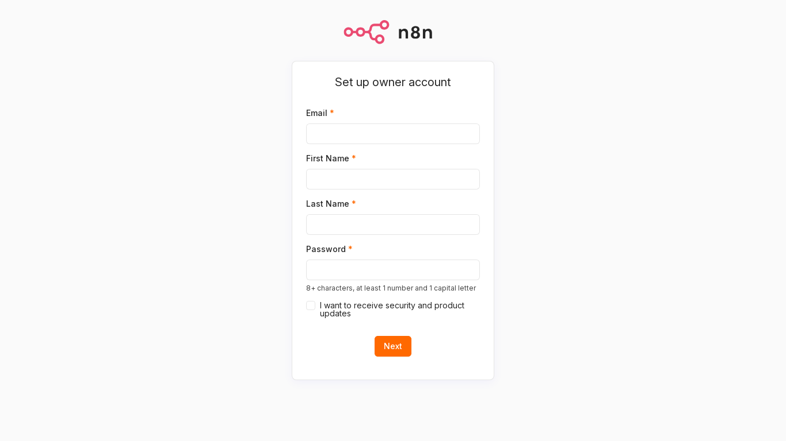
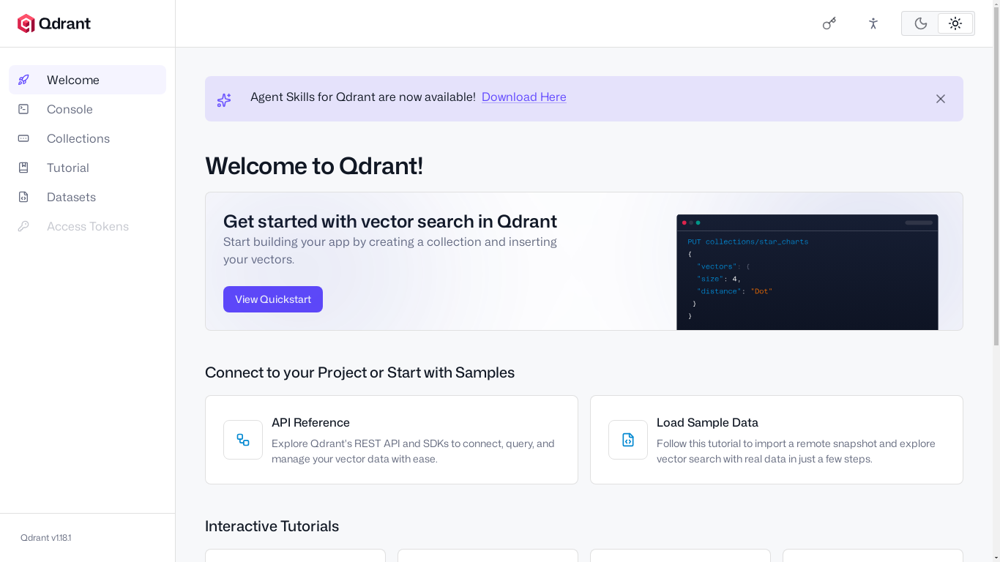
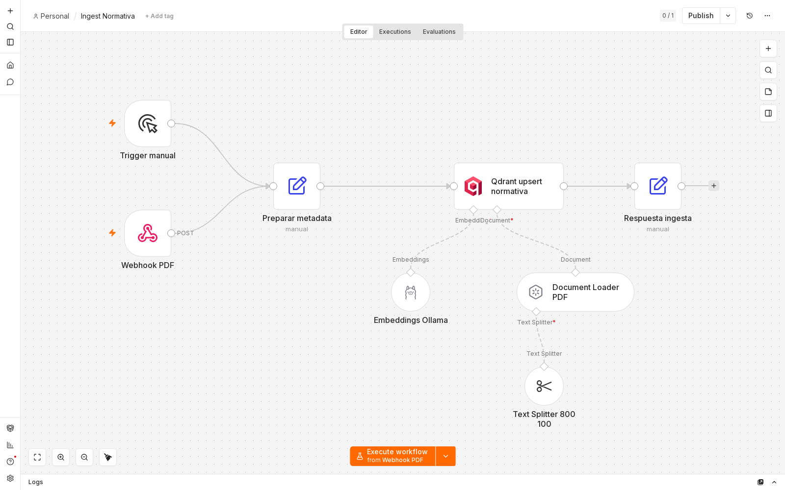
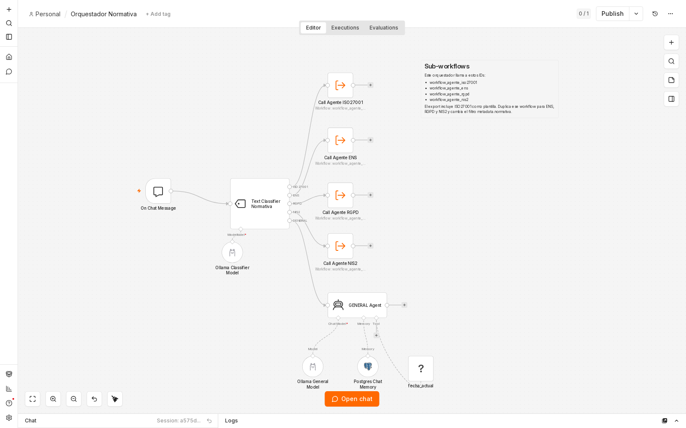
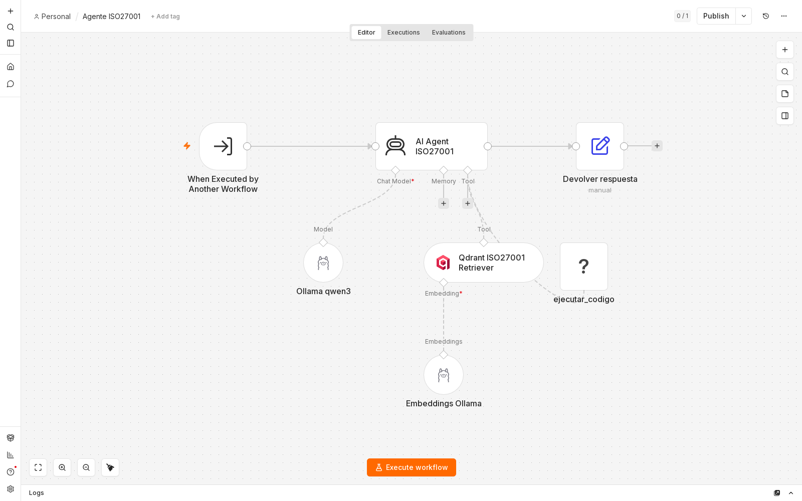

# Asistente normativa

Proyecto local para consultar normativa de ciberseguridad con n8n, Ollama, Qdrant y PostgreSQL.

El sistema permite ingestar PDFs de normativas, guardarlos en una base vectorial y hacer preguntas desde el chat de n8n. El flujo usa RAG: primero recupera fragmentos relevantes del documento y despues genera una respuesta con un modelo local.

## Componentes

- `n8n`: ejecuta los workflows, el chat y la orquestacion entre agentes.
- `Ollama`: ejecuta los modelos locales.
- `Qdrant`: guarda los fragmentos vectorizados de los PDFs.
- `PostgreSQL`: guarda los datos internos de n8n y la memoria del chat.
- `Docker Compose`: levanta todos los servicios.

Modelos configurados:

```text
qwen3:8b
nomic-embed-text:latest
```

## Archivos importantes

```text
docker-compose.yml
Dockerfile.n8n
.env.example
setup.sh
arrancar.txt
workflow_ingest.json
workflow_orquestador.json
workflow_agente_iso27001.json
```

- `docker-compose.yml`: define n8n, PostgreSQL, Qdrant y Ollama.
- `Dockerfile.n8n`: extiende n8n e instala `bash`, `python3` y `python3-pip`.
- `.env.example`: plantilla de variables de entorno.
- `setup.sh`: prepara una copia basada en el starter kit de n8n, copia los workflows, genera secretos si puede y arranca Docker.
- `arrancar.txt`: notas rapidas de arranque.
- `workflow_ingest.json`: workflow para ingestar PDFs.
- `workflow_orquestador.json`: workflow principal del chat.
- `workflow_agente_iso27001.json`: agente especializado en ISO 27001 y plantilla para crear otros agentes.

## Requisitos

- Docker Desktop instalado y abierto.
- Contenedores Linux activados.
- Docker Compose disponible.
- GPU NVIDIA compatible si se usa el perfil `gpu-nvidia`.
- Memoria suficiente para ejecutar `qwen3:8b`.

Comprobar Docker:

```powershell
docker version
```

## Configuracion inicial

Crear el archivo `.env`:

```powershell
Copy-Item .env.example .env
```

Editar `.env` y cambiar como minimo:

```env
POSTGRES_PASSWORD=...
N8N_ENCRYPTION_KEY=...
N8N_USER_MANAGEMENT_JWT_SECRET=...
```

Para generar claves en PowerShell:

```powershell
[Convert]::ToHexString((1..32 | ForEach-Object { Get-Random -Maximum 256 }))
```

Ejecutar el comando dos veces: una para `N8N_ENCRYPTION_KEY` y otra para `N8N_USER_MANAGEMENT_JWT_SECRET`.

No cambiar `N8N_ENCRYPTION_KEY` despues de crear credenciales en n8n, porque n8n la usa para descifrarlas.

## Arranque con setup.sh

El proyecto incluye un script de preparacion:

```bash
./setup.sh
```

Tambien se puede indicar una carpeta destino:

```bash
./setup.sh self-hosted-ai-starter-kit-normativa
```

El script:

1. Clona `https://github.com/n8n-io/self-hosted-ai-starter-kit.git` si no existe la carpeta destino.
2. Copia `docker-compose.yml`, `Dockerfile.n8n`, `.env.example` y los workflows.
3. Crea `.env` si no existe.
4. Genera secretos con `openssl` si esta disponible.
5. Arranca el sistema con Docker Compose.

Comando que ejecuta al final:

```bash
docker compose --profile gpu-nvidia up -d --build
```

En Windows se recomienda ejecutar `setup.sh` desde Git Bash, WSL o una terminal compatible con Bash.

## Arranque manual

Si se trabaja directamente desde esta carpeta:

```powershell
docker compose --profile gpu-nvidia up -d --build
```

Despues del primer arranque, normalmente basta con:

```powershell
docker compose --profile gpu-nvidia up -d
```

URLs principales:

```text
n8n: http://localhost:5678
Qdrant: http://localhost:6333/dashboard
Ollama: http://localhost:11434
```

## Capturas de arranque

Pantalla inicial de n8n al entrar en `http://localhost:5678`:



Dashboard de Qdrant en `http://localhost:6333/dashboard`:



Workflows importados en n8n:







Parar sin borrar datos:

```powershell
docker compose down
```

Parar y borrar volumenes:

```powershell
docker compose down -v
```

## Credenciales en n8n

Entrar en:

```text
http://localhost:5678
```

Crear el usuario inicial y revisar las credenciales de los nodos.

### Ollama

```text
Base URL: http://ollama:11434
API key: vacio
```

Si falla, probar:

```text
Base URL: http://ollama-gpu:11434
```

Dentro de n8n no usar `localhost:11434`, porque `localhost` apunta al contenedor de n8n.

### Qdrant

```text
Base URL: http://qdrant:6333
API key: vacio
```

### PostgreSQL

```text
Host: postgres
Port: 5432
Database: valor de POSTGRES_DB
User: valor de POSTGRES_USER
Password: valor de POSTGRES_PASSWORD
```

## Workflows

### Ingest Normativa

Archivo:

```text
workflow_ingest.json
```

Recibe un PDF por webhook y lo guarda en Qdrant.

Webhook:

```text
ingest-normativa
```

Espera:

- Un archivo PDF en el campo binario `data`.
- Un campo `normativa`, por ejemplo `ISO27001`, `ENS`, `RGPD`, `NIS2` o `ISO27041`.

Nodos principales:

- `Trigger manual`: permite ejecutar el workflow manualmente desde n8n durante pruebas.
- `Webhook PDF`: punto de entrada HTTP que recibe el PDF y el valor de `normativa`.
- `Preparar metadata`: normaliza los datos recibidos y prepara la metadata que se guardara junto al documento.
- `Document Loader PDF`: lee el contenido del PDF recibido en el campo binario `data`.
- `Text Splitter 800 100`: divide el texto en fragmentos pequenos para que puedan indexarse y recuperarse mejor.
- `Embeddings Ollama`: genera los vectores de cada fragmento usando el modelo de embeddings local.
- `Qdrant upsert normativa`: guarda los fragmentos y sus embeddings en la coleccion de Qdrant.
- `Respuesta ingesta`: devuelve una respuesta indicando que el documento se ha procesado.

El texto se divide con:

```text
chunk_size: 800
chunk_overlap: 100
```

Si no se envia `normativa`, usa `ISO27001`.

### Orquestador Normativa

Archivo:

```text
workflow_orquestador.json
```

Recibe preguntas desde el chat de n8n, las clasifica y llama al agente correspondiente.

Categorias configuradas:

```text
ISO27001
ENS
RGPD
NIS2
GENERAL
```

Nodos principales:

- `On Chat Message`: recibe el mensaje escrito por el usuario en el chat de n8n.
- `Text Classifier Normativa`: clasifica la pregunta segun la normativa a la que parece pertenecer.
- `Ollama Classifier Model`: modelo local usado por el clasificador para decidir la categoria.
- `Call Agente ISO27001`: llama al sub-workflow del agente ISO27001 cuando la pregunta encaja con esa norma.
- `Call Agente ENS`, `Call Agente RGPD`, `Call Agente NIS2`: ramas preparadas para llamar a agentes equivalentes cuando se creen.
- `GENERAL Agent`: responde consultas generales, ambiguas o comparativas.
- `Ollama General Model`: modelo local usado por la rama general.
- `Postgres Chat Memory`: guarda contexto de conversacion para mantener continuidad entre mensajes.
- `fecha_actual`: aporta la fecha actual al flujo cuando se necesita contexto temporal.

Nota: el proyecto incluye el agente ISO27001. Los agentes ENS, RGPD y NIS2 aparecen referenciados en el orquestador, pero hay que crearlos si se quieren usar de forma completa.

### Agente ISO27001

Archivo:

text
workflow_agente_iso27001.json


Responde preguntas sobre ISO/IEC 27001:2022. Busca en Qdrant usando el filtro:

Nodos principales:

- When Executed by Another Workflow: entrada del agente cuando lo llama el orquestador.
- AI Agent ISO27001: agente principal; recibe la pregunta, decide si necesita buscar contexto y redacta la respuesta.
- Ollama qwen3: modelo local usado para generar la respuesta.
- Qdrant ISO27001 Retriever: herramienta RAG que busca fragmentos relevantes en Qdrant.
- Embeddings Ollama: genera el embedding de la pregunta para poder compararla con los fragmentos indexados.
- ejecutar_codigo: herramienta auxiliar para ejecutar JavaScript sencillo si el agente necesita hacer calculos o transformaciones.
- Devolver respuesta: prepara la salida final para devolversela al orquestador.

json
{
  "must": [
    {
      "key": "metadata.normativa",
      "match": {
        "value": "ISO27001"
      }
    }
  ]
}


Incluye tambien la herramienta ejecutar_codigo, que permite ejecutar JavaScript sencillo dentro del flujo del agente.

## Importar workflows

El servicio n8n-import intenta importar los workflows automaticamente al arrancar si la base de datos esta vacia.

Si no aparecen en n8n:

1. Entrar en n8n.
2. Ir a Workflows.
3. Importar desde archivo.
4. Seleccionar:

text
workflow_ingest.json
workflow_orquestador.json
workflow_agente_iso27001.json


Despues de importar, revisar las credenciales asignadas en cada nodo.

## Ingestar un PDF

Para pruebas, abrir el workflow Ingest Normativa, pulsar Listen for test event en el nodo Webhook PDF y usar:

powershell
curl.exe -X POST http://localhost:5678/webhook-test/ingest-normativa `
  -F "data=@C:\ruta\al\documento.pdf" `
  -F "normativa=ISO27001"


Con el workflow activo, usar la URL de produccion:

powershell
curl.exe -X POST http://localhost:5678/webhook/ingest-normativa `
  -F "data=@C:\ruta\al\documento.pdf" `
  -F "normativa=ISO27001"


La metadata normativa debe coincidir despues con el filtro del agente.

## Usar el chat

Entrar en n8n, abrir Orquestador Normativa y usar el chat integrado.

Ejemplos:

text
Que controles de ISO 27001 tratan la gestion de accesos?


text
Que exige NIS2 sobre notificacion de incidentes?


text
Compara ENS e ISO 27001 en gestion de riesgos.


Para que una normativa responda correctamente, su PDF debe estar ingestada y debe existir un agente conectado al orquestador.

## Anadir una normativa

Ejemplo para ISO27041:

1. Ingestar el PDF:

powershell
curl.exe -X POST http://localhost:5678/webhook/ingest-normativa `
  -F "data=@C:\ruta\al\ISO27041.pdf" `
  -F "normativa=ISO27041"


2. Duplicar workflow_agente_iso27001.json.
3. Cambiar id, nombre, prompt, nombre de herramienta y filtro de Qdrant.
4. Usar el mismo valor de metadata:

json
{
  "must": [
    {
      "key": "metadata.normativa",
      "match": {
        "value": "ISO27041"
      }
    }
  ]
}


5. Anadir la categoria al clasificador del orquestador.
6. Crear una rama que llame al nuevo workflow.

## Comandos utiles

Ver servicios:

powershell
docker compose ps


Ver logs:

powershell
docker compose logs --tail 200 n8n
docker compose logs --tail 200 ollama-gpu
docker compose logs --tail 200 qdrant


Reiniciar n8n:

powershell
docker compose restart n8n


Ver modelos de Ollama:

powershell
curl.exe http://localhost:11434/api/tags


Actualizar imagenes:

powershell
docker compose pull
docker compose --profile gpu-nvidia up -d


## Problemas comunes

### Docker no responde

Abrir Docker Desktop y esperar a que arranque. Despues comprobar:

powershell
docker version


### n8n no conecta con Ollama

Revisar que la credencial use:

text
http://ollama:11434


o:

text
http://ollama-gpu:11434


### El webhook devuelve 404

- Para /webhook-test/, el nodo debe estar en Listen for test event.
- Para /webhook/, el workflow debe estar activo.

### Qdrant no recibe el PDF

El archivo debe enviarse en el campo data:

powershell
-F "data=@C:\ruta\al\documento.pdf"


Si falla, revisar que el nodo Preparar metadata conserve los datos binarios.

### Qdrant no devuelve resultados

Comprobar que coinciden:

- QDRANT_COLLECTION.
- Valor enviado en normativa.
- Filtro metadata.normativa del agente.

## Seguridad

El proyecto esta pensado para uso local.

- No exponer n8n directamente a Internet.
- Usar secretos fuertes en .env.
- No cambiar N8N_ENCRYPTION_KEY despues de crear credenciales.
- Hacer copias de seguridad si se guardan datos importantes.
- Revisar el uso de ejecutar_codigo, porque ejecuta JavaScript dentro del flujo.
